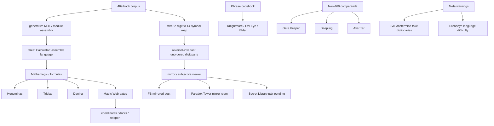

# Auditoria aprofundada 469 — relações lore, fontes escondidas e hipóteses não mapeadas

**Projeto:** `kimlage/469_sargam`
**Data:** 2026-06-18
**Escopo:** aprofundar exaustivamente as teorias levantadas na auditoria inicial: Great Calculator, fórmulas de Demona/Magic Web, pares/espelhos, Secret Library, Paradox Tower, Wydrin/madman, Spirit Grounds, minotaur mages, Serpentine Tower, matrizes ambientais e fontes meta-lore.
**Veredito operacional:** nenhuma fonte examinada fornece uma tradução nova ou um par oficial número↔plaintext. O aprofundamento reforça uma mudança de foco: as melhores pistas novas não apontam para “plaintext escondido nos livros”, mas para **mecanismo de montagem / fórmula / recombinação / lookup geométrico**.

---

## 0. Sumário executivo

O relatório final atual do projeto já estabelece que o corpus 469 contém duas camadas independentes: uma camada de frases/NPC/polls com grupos variáveis de dígitos e uma camada de 70 livros com sistema mecânico fixo 2-dígitos→14 símbolos. A camada dos livros tem reconstrução mecânica 70/70, mas falha como linguagem natural em frequência, geometria de mapa e estrutura sequencial. A hipótese mais forte do projeto é que os livros são melhor descritos por um modelo generativo de recombinação/copy-paste do que por uma mensagem linguística.

A auditoria de lore não encontra uma “Rosetta stone”. Porém, encontra um **conjunto submapeado de fontes que se alinham melhor com o resultado generativo**:

1. **Great Calculator / assemble the bonelords language** — a fonte mais importante. O verbo “assemble” combina diretamente com a prova MDL/copy-paste do projeto. Deve virar hipótese explícita: *a lore talvez descreva a criação do sistema, não a tradução dos livros*.
2. **Honeminas + Tridiag + Donina + Red Light + Teleportation Through the Magic Web** — família de fórmulas/gates/magic web que deve ser testada como **modelo de geração/seleção/coordenação**, não só como tentativa de plaintext.
3. **Pares, espelho e subjetividade** — FB post, Honeminas, Secret Library `74032 45331` (ainda sem confirmação primária), Paradox Tower e a fala do Wrinkled Bonelord sobre fórmula variável “para o observador subjetivo” formam uma trilha coerente com reversão, pares não ordenados e geometria.
4. **Spirit Grounds / Gate Keeper e outras línguas** — não parecem 469, mas são úteis como controles negativos contra pareidolia.
5. **Wydrin/madman, Evil Mastermind/fake dictionaries, Dreadeye, First Dragon, Imortus, Serpentine Tower, Hellgate matrix, Robson** — fontes com valor contextual ou de watchlist, mas sem força suficiente para guiar decodificação.

A recomendação é criar um novo módulo de pesquisa:

```text
analysis/lore_audit_20260618/
  00_source_registry.yaml
  01_source_inventory.py
  02_formula_family_overlap.py
  03_pair_geometry_audit.py
  04_mirror_paradox_audit.py
  05_great_calculator_assembly_test.py
  06_non469_language_comparanda.py
  07_watchlist_official_groundtruth.py
  README.md
```

E uma página documental:

```text
docs/wiki/08-lore-source-audit.md
```

---

## 1. Linha de base: o que o projeto já sabe

### 1.1 Resultado central já aceito

O projeto já deve permanecer ancorado nos seguintes fatos internos:

| Área | Estado atual |
|---|---|
| Camadas | Duas camadas: frases/NPC/poll e livros. |
| Livros | 70 livros, 11.263 dígitos, 5.729 símbolos, 99/100 códigos usados. |
| Mecânica dos livros | Sistema determinístico 2-dígitos→14 símbolos, reconstrução 70/70. |
| Frases | Pequeno word-code de grupos variáveis, útil como validação, não como chave dos livros. |
| Linguagem natural nos livros | Rejeitada por perfil de frequência, geometria do mapa e templating/copy-paste. |
| Matemágica como plaintext | Tentativas anteriores fecharam com `NO_PLAINTEXT` / `NO_GLOSS`. |
| Único desbloqueio forte | Nova fonte oficial CipSoft com par número↔texto ou tabela oficial. |

### 1.2 Reinterpretação necessária

A seção “mathemagic” do projeto já fecha a hipótese “matemágica gera plaintext legível”. A nova auditoria propõe uma nuance:

> **Não usar lore matemática para tentar traduzir os livros. Usar lore matemática para testar se ela descreve o mecanismo que gerou os livros.**

Isso evita reabrir uma via já falsificada e transforma a investigação em hipótese mecanística.

---

## 2. Metodologia da auditoria

### 2.1 Classes de evidência

Usei cinco classes:

| Classe | Definição | Exemplo |
|---|---|---|
| `GROUND_TRUTH` | Fonte oficial com par número↔plaintext. | Nenhuma nova encontrada. |
| `MECHANISM_LORE` | Fonte que pode descrever como 469 é montado/calculado. | Great Calculator, Honeminas. |
| `NUMERIC_ANCHOR` | Número externo confirmado, mas sem gloss. | 2020 poll option C, Chayenne, Your True Colour. |
| `COMPARANDUM` | Outra língua/puzzle que ajuda como controle negativo. | Gate Keeper, Deepling. |
| `PAREIDOLIA_RISK` | Relação numérica visual sem força preditiva. | Serpentine Tower soma 469, skull matrix. |

### 2.2 Regra de promoção

Nada deve ser promovido como “avanço de tradução” sem satisfazer pelo menos uma condição:

1. Fonte oficial CipSoft com texto equivalente.
2. Predição nova que acerta holdout antes de olhar o alvo.
3. Ganho estatístico contra controles negativos rigorosos.
4. Redução de MDL/generative cost que vence controles e não depende de ajuste pós-hoc.

### 2.3 Controles obrigatórios

Toda hipótese abaixo precisa de:

- `book_shuffle_control`: embaralhar dígitos/símbolos por livro preservando frequências.
- `source_decoy_control`: aplicar o mesmo pipeline em números de livros Tibia não relacionados a 469.
- `pair_null_control`: gerar pares aleatórios com mesma faixa/tamanho e comparar geometria.
- `formula_null_control`: permutar variáveis/números das fórmulas de Demona.
- `blind_refuter`: implementação independente tentando quebrar o resultado.

---

## 3. Inventário de lacunas no repo atual

Buscas no repositório `kimlage/469_sargam` retornaram ausência para vários termos que aparecem nas fontes externas:

```text
Great Calculator
Wydrin / Wyrdin
Tridiag
Spirit Grounds
Secret Library 74032 45331
Zg'!kch
Minotaur mages
Paradox mirror
Dreadeye
Evil Mastermind
Imortus
First Dragon
Robson
Serpentine Tower
```

Isso não significa que o projeto ignorou totalmente as ideias relacionadas; por exemplo, “mathemagic”, “Honeminas”, `3478`, Avar Tar, Chayenne, polls e outras fontes já aparecem no relatório final. A lacuna é mais específica: **essas fontes não parecem estar organizadas como uma família de lore mecanística**.

---

# 4. Hipótese H1 — Great Calculator / Assembly Hypothesis

## 4.1 Fonte

O livro **You Cannot Even Imagine** contém a frase:

```text
It was me who assisted the great calculator to assemble the bonelords language.
```

Pontos importantes:

- A fonte fala em **the great calculator**.
- O verbo é **assemble**, não “invent”, “translate”, “encrypt” ou “write”.
- O livro também diz que palavras não preservam a essência das memórias, criando uma oposição lore entre linguagem comum e outro tipo de preservação.

## 4.2 Relação com o projeto

O resultado final do projeto diz que os livros são mais baratos de descrever por recombinação digit-level / módulo+montagem do que por tokenizações concorrentes. Logo, a frase “assemble the bonelords language” é a maior convergência externa com o modelo:

```text
lore: assemble language
projeto: assembled / copied / recombined digit modules
```

Essa relação não prova tradução; ela apoia um **modelo de origem**.

## 4.3 Hipótese formal

```text
H1:
A lore do Great Calculator descreve a criação do sistema 469 como montagem calculada
de módulos/regras, não como cifragem de um plaintext natural.
```

## 4.4 Predições testáveis

| Predição | Como testar | Critério de sucesso |
|---|---|---|
| P1: os livros parecem “montados” | MDL por inventário de módulos + assembly | Já positivo no projeto; reexecutar com ablação. |
| P2: módulos são reutilizados como unidades, não reencifrados | comparar repeats digit-verbatim vs homophone re-encipher controls | Já positivo no projeto; integrar à página lore. |
| P3: fontes “calculator/formula” predizem propriedades do mecanismo | buscar pares, reversões, coordenadas, vetores, gates | Precisa novo pipeline. |
| P4: a hipótese explica sem gerar plaintext | resultado deve ser mecanismo-only | `ACCEPTED_MECHANISM`, não `TRANSLATION`. |

## 4.5 Teste recomendado

Arquivo:

```text
analysis/lore_audit_20260618/05_great_calculator_assembly_test.py
```

Entradas:

- Corpus raw dos 70 livros.
- Stream canonical row0.
- Módulos do `analysis/audit_20260609`.
- Fonte `You Cannot Even Imagine`.
- Lista de termos: `assemble`, `calculator`, `formula`, `mathemagic`, `gate`, `coordinate`, `subjective viewer`.

Saídas:

```text
great_calculator_assembly_report.json
great_calculator_assembly_report.md
```

Métricas:

- `module_inventory_bits`
- `assembly_instruction_bits`
- `literal_residual_bits`
- `digit_verbatim_repeat_count`
- `repeat_under_reencipher_null`
- `lore_alignment_score` — qualitativo, não usado como prova estatística sozinho.

## 4.6 Veredito H1

| Campo | Valor |
|---|---|
| Prioridade | P0 |
| Tipo | Mechanism-lore |
| Pode traduzir? | Não |
| Pode explicar origem? | Sim, forte |
| Status recomendado | `ACCEPTED_AS_MECHANISM_HYPOTHESIS_PENDING_REAUDIT` |

---

# 5. Hipótese H2 — Demona Formula Family / Magic Web as Generator

## 5.1 Fontes

A família inclui:

- **The Honeminas Formula**
- **The Tridiag Formula**
- **The Donina Formula I**
- **The Donina Formula II**
- **Investigation of the Red Light**
- **Teleportation Through the Magic Web**
- Demona Library como contexto de localização.

### Honeminas

Elementos relevantes:

```text
g[a_,x_] := a g[3,2] + (4,3,1,5,3).(3,4,7,8,4)
e=3m*2g+3p
```

Observações:

- O texto define `g` como gate.
- `g[a_,x_]` representa coordenadas em uma área 2D.
- `e` representa energia que flui para o gate.
- A fórmula contém o bloco `3478` no segundo vetor.
- O uso de dois vetores de cinco números dialoga com a lore dos olhos/blinks, mas isso é hipótese, não fato comprovado.

### Tridiag

Elementos relevantes:

```text
a=3er*8g+99k
g[a_,l_] := e*g[1,1]+9g*3a
h:=3pe-34u
```

Observações:

- O texto se declara baseado em Honeminas.
- Contém `99`, que dialoga com os 99 códigos usados nos livros.
- Contém `34`, anchor mecânico do projeto (`34=B`).
- Contém `3`, `8`, `9`, `1`, `l`, `g`, variáveis e coordenadas.

### Donina I/II

Elementos:

```text
ft:=E[3,2,3]*fd(3.2),as->20
io=g[i,u]+2
ds(%)="[tr3+12\32p-q]"
gh/3u+32=<%sd>
```

Observações:

- Reforça a família formula/gate/magic web/red light.
- Tem notação algébrica pseudo-programática, arrays e operadores.
- Não traz gloss de 469.

### Red Light / Teleportation

Elementos:

- Red Light controla gates da magic web.
- Teleportation usa parte da fórmula Honeminas para abrir portas especiais.
- Destinos não são controláveis, sugerindo sistema de seleção/portas/gates, não linguagem.

## 5.2 Relação com o projeto

O projeto já testou “mathemagic” como decodificador e fechou sem plaintext. A nova pergunta é diferente:

```text
A família de fórmulas prediz propriedades de montagem, seleção,
coordenadas ou lookup do corpus?
```

## 5.3 Hipóteses formais

```text
H2A:
As fórmulas de Demona não decodificam plaintext, mas modelam operadores locais
de geração/seleção de módulos.

H2B:
Os elementos g[a_,x_], vetores de 5 números, gates e coordenadas 2D representam
uma metáfora ou pista para indexação, não para substituição linguística.

H2C:
O bloco 3478 em Honeminas é uma convergência lore/mecânica real, mas limitado:
ele ancora "BE" no phrase-code e na geometria row0; não abre o corpus.
```

## 5.4 Testes recomendados

Arquivo:

```text
analysis/lore_audit_20260618/02_formula_family_overlap.py
```

### Teste 1 — overlap de números

Números/fatores a extrair:

```text
Honeminas:
3,2,4,3,1,5,3,3,4,7,8,4,3478,43153,34784

Tridiag:
3,8,99,1,1,9,3,34

Donina:
3,2,3,3.2,20,2,3,12,32,3,32

Magic Web:
gate, coordinate, red light, teleport, door, random destination
```

Comparar contra:

- raw digits dos livros;
- aligned 2-digit codes;
- row0 symbol stream;
- phrase codebook;
- módulos MDL;
- fontes externas numéricas.

Saídas esperadas:

```json
{
  "needle": "3478",
  "raw_occurrences": "...",
  "aligned_code_occurrences": "...",
  "symbol_interpretation": "34|78 = B|E",
  "control_p": "...",
  "status": "STRUCTURAL_ANCHOR_ONLY"
}
```

### Teste 2 — operadores locais

Operadores a testar:

- split por pares;
- split por vetores de 5;
- dot product;
- soma por posição;
- diferença por posição;
- produto por posição;
- módulo 10/14/99/100;
- troca esquerda↔direita;
- reverse digit-pair;
- lookup por unordered pair;
- coordenadas `(a,x)` em grid.

Critério de sucesso:

- O operador deve prever estrutura já não usada no ajuste.
- Não basta gerar números que “aparecem” no corpus.
- Deve vencer `formula_null_control`.

### Teste 3 — fórmula como gerador de módulos

Pergunta:

> Algum operador simples derivado das fórmulas gera os blocos repetidos identificados pelo MDL?

Critérios:

- Comprimir o corpus com custo menor que o modelo baseline.
- Perder nos controles.
- Não produzir plaintext; produzir mecanismo.

## 5.5 Veredito H2

| Campo | Valor |
|---|---|
| Prioridade | P0/P1 |
| Tipo | Mechanism-lore |
| Pode traduzir? | Baixíssima chance |
| Pode explicar montagem? | Sim |
| Status recomendado | `REOPEN_AS_GENERATOR_ONLY`, não `REOPEN_AS_PLAINTEXT` |

---

# 6. Hipótese H3 — Pair Geometry / Mirror / Subjective Viewer

## 6.1 Fontes

Elementos agregados:

- Honeminas usa dois vetores lado a lado.
- FB post de 2011 tem lista de pares numéricos extraídos por espelhamento.
- s2ward registra um par Secret Library `74032 45331`, ainda sem confirmação textual na TibiaWiki/Secret Library/Books.
- A Wrinkled Bonelord diz que o nome da raça em sua linguagem “não é fixo”, mas uma fórmula complexa que muda para o “subjective viewer”.
- O projeto descobriu que o mapa 2-dígitos→símbolo é quase totalmente invariável por reversão: trocar os dígitos de um código preserva o símbolo em quase todos os pares não-palindrômicos.

## 6.2 Hipótese formal

```text
H3:
469 usa uma geometria de pares/espelho/observador onde a ordem dos dois dígitos
é parcialmente apagada ou simetrizada. Essa geometria é mecanismo de escrita,
não canal de plaintext.
```

## 6.3 Por que esta hipótese é forte

Diferente de outras ideias lore, esta conversa diretamente com uma propriedade técnica já verificada:

```text
lore: olhos, piscar, observador, espelho, pares
mecânica: unordered digit pair / reversal-invariant lookup
```

## 6.4 Testes recomendados

Arquivo:

```text
analysis/lore_audit_20260618/03_pair_geometry_audit.py
```

### Dados de pares

```yaml
sources:
  honeminas_vectors:
    left: 43153
    right: 34784
    confidence: primary_text
  fb_post_pairs:
    confidence: secondary_extraction_from_s2ward
  secret_library_pair:
    left: 74032
    right: 45331
    confidence: unconfirmed_secondary
  hellgate_matrix_old:
    confidence: environmental_secondary
  hellgate_matrix_new:
    confidence: environmental_secondary
```

### Métricas

- `left > right` frequência.
- razão `left/right`.
- diferença `left-right`.
- monotonicidade.
- regressão linear dos pares.
- distância do par ao conjunto de códigos row0.
- presença de zeros e impacto do taboo de `0`.
- split em 2 dígitos.
- split em 5 olhos.
- reverso por par e reverso total.
- projeção em alfabeto 14-symbol.

### Controles

- pares aleatórios com mesmos dígitos;
- pares de livros não-469;
- pares extraídos de fórmulas sem lore bonelord;
- permutação das colunas esquerda/direita.

## 6.5 Status do Secret Library pair

O par `74032 45331` deve ser mantido como `PENDING_PRIMARY_CONFIRMATION`.

Motivo:

- Está registrado por s2ward como “Secret Library book”.
- A página textual `Secret Library/Books` consultada não contém `74032`, `45331`, `469` ou `bonelord`.
- Pode estar em imagem, mapa, item, edição não transcrita ou fonte fora da página textual.

Ação:

```text
- localizar screenshot/in-game coordenada
- confirmar livro/objeto
- registrar path, local, versão e transcrição exata
- só então usar como external numeric anchor
```

## 6.6 Veredito H3

| Campo | Valor |
|---|---|
| Prioridade | P1 |
| Tipo | Mechanism geometry |
| Pode traduzir? | Não diretamente |
| Pode explicar row0 reversal? | Sim, é a melhor ponte lore↔mecânica |
| Status recomendado | `ACTIVE_MECHANISM_AUDIT` |

---

# 7. Hipótese H4 — Paradox Tower mirror room / Riddler books

## 7.1 Fontes

Paradox Tower / Mad Mage Valley contém livros com “gibberish” alfabético:

```text
ljkhbl nilse jfpce ojvco ld
slcld ylddiv dnolsd dd sd
sdcp cppcs cccpc cpsc
awdp cpcw cfw ce
cpvc ev vcemmev vrvf
cp fd vmfpm xcv
```

e:

```text
dtjfhg
jhfvzk
bbliiug
bkjjjjjjj
xhvuo
fffff
zkkbk h
lbhiovz
klhi igbb
```

s2ward observa a possível relação com espelho/Paradox Tower, mas isso não é prova.

## 7.2 Hipótese formal

```text
H4:
Os livros gibberish da Paradox Tower são comparanda de construção artificial;
podem compartilhar estilo de geração/espelhamento com 469, mas não são uma chave direta.
```

## 7.3 Testes recomendados

Arquivo:

```text
analysis/lore_audit_20260618/04_mirror_paradox_audit.py
```

Testes:

1. Estatísticas simples:
   - alfabeto usado;
   - frequência;
   - bigramas/trigramas;
   - repetição;
   - compressibilidade.
2. Reversões:
   - reverse total;
   - reverse por palavra;
   - reverse por linha;
   - espelho esquerda/direita.
3. Substituições:
   - Caesar;
   - Atbash;
   - teclado;
   - homofônico simples;
   - redução para 13/14 símbolos.
4. Comparação com row0:
   - perfil de repetição;
   - pureza de pares;
   - MDL por módulos.

Critério de sucesso:

- Só aceitar relação se o mesmo operador prediz propriedade não trivial em 469 e nos livros Paradox contra controles.

## 7.4 Veredito H4

| Campo | Valor |
|---|---|
| Prioridade | P2 |
| Tipo | Comparandum/mechanism |
| Pode traduzir? | Muito improvável |
| Status recomendado | `CONTROL_AND_STYLE_COMPARANDUM` |

---

# 8. Hipótese H5 — Minotaur mages “close to the truth”

## 8.1 Fonte

A Wrinkled Bonelord diz sobre minotauros:

```text
Their mages are so close to the truth.
Closer then they know and closer then it's good for them.
```

## 8.2 Hipótese formal

```text
H5:
A trilha dos minotaur mages aponta para uma família de magia/fórmula/labirinto/verdade
relevante à linguagem 469.
```

## 8.3 Avaliação

Valor potencial:

- Fala direta do NPC central.
- Pode conectar com Mintwall, minotaur mages, labirintos, magia e matemática.

Limitações:

- Não contém números.
- Não contém 469.
- Não contém gloss.
- Pode ser lore genérica.

## 8.4 Teste recomendado

Arquivo:

```text
analysis/lore_audit_20260618/08_minotaur_mage_truth_audit.py
```

Busca de fontes:

- `Minotaur Mage`
- `Mintwall`
- `truth`
- `mathematics`
- `bonelord`
- `beholder`
- `labyrinth`
- `mage`
- `formula`

Critério:

- Promover apenas se surgir fonte numérica, fórmula, menção direta a Bonelord language ou link oficial com 469.

## 8.5 Veredito H5

| Campo | Valor |
|---|---|
| Prioridade | P2/P3 |
| Tipo | Lore watchlist |
| Pode traduzir? | Não |
| Status recomendado | `WATCHLIST_CONTEXT_ONLY` |

---

# 9. Hipótese H6 — Spirit Grounds / Gate Keeper como comparandum negativo

## 9.1 Fonte

The Gate Keeper usa uma forma não-pronunciável:

```text
Zg'!kch of Cthle-ZüuKh'lkrlxchwr
```

A fala envolve doors, keys, realms, spirits, Ancients e tempo sem significado.

## 9.2 Hipótese formal

```text
H6:
Spirit Grounds não é 469; é um comparandum para controlar falsas associações
entre “incompreensível”, “antigo” e “linguagem escondida”.
```

## 9.3 Por que incluir

Sem comparanda negativos, qualquer texto estranho vira pista. Esta fonte ajuda a treinar o projeto para dizer:

```text
estranho ≠ 469
unpronounceable ≠ numeric bonelord language
doors/gates ≠ magic web formula
```

## 9.4 Testes

Arquivo:

```text
analysis/lore_audit_20260618/06_non469_language_comparanda.py
```

Comparar:

- Gate Keeper;
- Deepling;
- Avar Tar;
- fake Bonelord dictionaries;
- gibberish Paradox.

Saída:

```text
non469_language_comparanda.md
```

Conteúdo:

- por que cada fonte não deve ser usada como decoder;
- quais propriedades são úteis como controle;
- quais palavras-chave causam pareidolia.

## 9.5 Veredito H6

| Campo | Valor |
|---|---|
| Prioridade | P2 |
| Tipo | Negative control |
| Pode traduzir? | Não |
| Status recomendado | `CONTROL_NEGATIVE` |

---

# 10. Hipótese H7 — Secret Library `74032 45331`

## 10.1 Fonte

s2ward registra:

```text
Secret Library book (2018)
74032 45331
```

## 10.2 Problema

A página textual da TibiaWiki `Secret Library/Books` lista livros regulares da Secret Library, mas a busca textual não encontrou `74032`, `45331`, `469` ou `bonelord`.

## 10.3 Hipótese formal

```text
H7:
Se confirmado in-game, `74032 45331` é um anchor numérico externo pós-corpus,
talvez parte da família pair-geometry.
```

## 10.4 Plano de confirmação

1. Obter screenshot do livro/objeto.
2. Identificar seção da Secret Library.
3. Confirmar se é livro regular, parede, imagem, decoração ou puzzle.
4. Registrar versão de implementação.
5. Verificar se há texto adicional.
6. Só então rodar testes.

## 10.5 Testes após confirmação

- substring raw nos 70 livros;
- split 2-dígitos:
  - `74|03|2?` / `45|33|1?` precisa lidar com comprimento ímpar;
  - testar com omissão de zero inicial;
- split 5-olhos:
  - `7,4,0,3,2` e `4,5,3,3,1`;
- reverso:
  - `23047`, `13354`;
- operações:
  - diferença `74032 - 45331 = 28701`;
  - soma `119363`;
  - gcd;
  - modulo 14/99/100;
- comparação com Honeminas vectors.

## 10.6 Veredito H7

| Campo | Valor |
|---|---|
| Prioridade | P1 se confirmado, P3 enquanto não confirmado |
| Tipo | Pending external numeric anchor |
| Pode traduzir? | Não |
| Status recomendado | `PENDING_PRIMARY_CONFIRMATION` |

---

# 11. Hipótese H8 — Wydrin / “madman”

## 11.1 Fonte

Wydrin/Wyrdin diz:

```text
Could the language of bonelords be the invention of some madman?
```

## 11.2 Relação com H1/H4

Essa fala liga:

- inventor/madman;
- Paradox Tower/Mad Mage;
- mathemagic;
- possível criação artificial;
- Great Calculator.

## 11.3 Hipótese formal

```text
H8:
A fala de Wydrin aponta para autoria artificial/mad-mage/mathemagic,
mas não contém mecanismo suficiente.
```

## 11.4 Testes

Apenas como link de grafo lore:

```yaml
node: Wydrin_madman
edges:
  - Great_Calculator
  - Paradox_Tower
  - Mathemagic
  - Artificial_language
status: contextual
```

## 11.5 Veredito H8

| Campo | Valor |
|---|---|
| Prioridade | P3 |
| Tipo | Lore graph edge |
| Pode traduzir? | Não |
| Status recomendado | `CONTEXTUAL_EDGE_ONLY` |

---

# 12. Hipótese H9 — Serpentine Tower / soma 469

## 12.1 Fonte

s2ward registra pesquisa de Serpentine Tower com research papers numerados. Somando alguns números e omitindo um paper, chega-se a 469.

## 12.2 Avaliação

Isso é alto risco de pareidolia:

- Exige escolher quais termos contar.
- Exige omitir um paper.
- Não gera texto.
- Não conecta diretamente ao row0.

## 12.3 Teste recomendado

Arquivo:

```text
analysis/lore_audit_20260618/09_serpentine_numerology_control.py
```

Comparar:

- quantas somas similares podem produzir 469 em outras bibliotecas;
- quantas escolhas de subset existem;
- se há menção oficial a Bonelord/469;
- se a soma prediz alguma coisa nova.

## 12.4 Veredito H9

| Campo | Valor |
|---|---|
| Prioridade | P3/P4 |
| Tipo | Numerology risk |
| Pode traduzir? | Não |
| Status recomendado | `LOW_CONFIDENCE_NUMEROLOGY` |

---

# 13. Hipótese H10 — Hellgate skull matrix / old matrix

## 13.1 Fonte

s2ward registra uma matriz antiga pré-2010 e uma matriz alterada pós-rename/copyright, associada por jogadores a Hellgate/469.

## 13.2 Avaliação

Problemas:

- Ambiental, não texto.
- Mudou com update.
- Pode ter sido alterada por razões visuais/quest/decoração.
- Sem gloss.

## 13.3 Testes

- Preservar como fonte histórica.
- Não usar como decoder.
- Comparar matriz old/new com:
  - 4x4 digit arrangements;
  - row0 unordered pairs;
  - `469`;
  - zero omission;
  - Honeminas vectors.
- Rodar `matrix_null_control`: quantas matrizes 4x4 aleatórias produzem padrões sedutores?

## 13.4 Veredito H10

| Campo | Valor |
|---|---|
| Prioridade | P4 |
| Tipo | Environmental numerology |
| Status recomendado | `DOCUMENTED_LOW_CONFIDENCE` |

---

# 14. Hipótese H11 — Evil Mastermind / fake dictionaries

## 14.1 Fonte

Evil Mastermind menciona “fake Bonelord language dictionaries” e “calculations”.

## 14.2 Interpretação

Esta é uma pista meta-lore valiosa, mas negativa:

```text
fake dictionaries = alerta contra codebooks comunitários falsos
```

Ela combina com a história do projeto: muitas soluções plausíveis, inclusive solução alemã com 100% de cobertura mecânica, falham nos cribs e controles.

## 14.3 Uso recomendado

Adicionar no registro externo:

```text
Evil Mastermind fake dictionaries:
status = META_WARNING
meaning = in-game warning against fake Bonelord dictionaries / overfit codebooks
```

## 14.4 Veredito H11

| Campo | Valor |
|---|---|
| Prioridade | P2 documental |
| Tipo | Anti-pareidolia lore |
| Pode traduzir? | Não |
| Status recomendado | `META_WARNING` |

---

# 15. Hipótese H12 — Dreadeye / alien parts of writings

## 15.1 Fonte

Dreadeye diz que apenas bonelords verdadeiros entendem a linguagem e que, em seu estado alterado, mesmo ele tem dificuldade com partes simples e algumas partes são alienígenas para ele.

## 15.2 Interpretação

Isso suporta:

- heterogeneidade interna;
- dificuldade até para bonelords alterados;
- linguagem não humana;
- possibilidade de partes alienígenas/não linguísticas.

Não oferece mecanismo direto.

## 15.3 Uso recomendado

Adicionar como contexto que reforça a impossibilidade de tratar todo o corpus como texto humano simples.

## 15.4 Veredito H12

| Campo | Valor |
|---|---|
| Prioridade | P3 |
| Tipo | Contextual support |
| Pode traduzir? | Não |
| Status recomendado | `CONTEXT_ONLY` |

---

# 16. Hipótese H13 — First Dragon / futura história de como aprendeu Bonelord language

## 16.1 Fonte

The First Dragon diz que aprendeu a linguagem bonelord e guardou a história para possível parte dois de suas memórias.

## 16.2 Interpretação

Isto é watchlist:

- Pode haver futuro conteúdo oficial.
- Não contém texto 469.
- Não contém número.
- Não contém método.

## 16.3 Uso recomendado

Adicionar ao monitoramento:

```yaml
watchlist:
  - source: First Dragon memoirs possible part two
  - trigger: new official book / event / memoir with bonelord language
```

## 16.4 Veredito H13

| Campo | Valor |
|---|---|
| Prioridade | P3 watchlist |
| Tipo | Future official hook |
| Status recomendado | `WATCHLIST_ONLY` |

---

# 17. Hipótese H14 — Imortus / fansite item

## 17.1 Fonte

s2ward registra Imortus como item de fansite/TibiaML com:

```text
46.90 oz
469!? So easy...
More eyes for many numbers!
```

## 17.2 Avaliação

Baixa força:

- Parece fansite/award item.
- É meta e brincalhão.
- Não fornece gloss.

## 17.3 Uso recomendado

Manter como curiosidade/meta, não como fonte canônica para análise.

## 17.4 Veredito H14

| Campo | Valor |
|---|---|
| Prioridade | P4 |
| Tipo | Meta/fansite |
| Status recomendado | `LOW_CONFIDENCE_META` |

---

# 18. Hipótese H15 — Robson / arquitetura de bonelord hideout

## 18.1 Fonte

Robson compara ruínas/pilares a esconderijo bonelord.

## 18.2 Avaliação

Valor apenas arqueológico/ambiental:

- Sem números.
- Sem linguagem.
- Sem fórmula.
- Pode indicar presença antiga, não decodificação.

## 18.3 Veredito H15

| Campo | Valor |
|---|---|
| Prioridade | P4 |
| Tipo | Environmental lore |
| Status recomendado | `DOCUMENT_ONLY` |

---

# 19. Hipótese H16 — Braindeath / necromancy / broken mind

## 19.1 Fonte

Lore de Braindeath e Bonelord Threat descreve bonelords, necromancia, experimentos, city/labs, race decline.

## 19.2 Avaliação

Importante para lore racial, mas fraco para 469:

- Sem números.
- Sem fórmula.
- Sem texto 469.
- Pode explicar por que a língua é alien/necromantic, mas não como testá-la.

## 19.3 Veredito H16

| Campo | Valor |
|---|---|
| Prioridade | P4 |
| Tipo | Contextual lore |
| Status recomendado | `BACKGROUND_ONLY` |

---

# 20. Grafo unificado de relações



---

# 21. Ranking final de hipóteses

| Rank | Hipótese | Prioridade | Por quê |
|---:|---|---|---|
| 1 | Great Calculator / assembly | P0 | Melhor encaixe com generative MDL/copy-paste. |
| 2 | Demona formula family como generator | P0/P1 | Fonte primária com fórmula, gates, vetores, `3478`, `99`, `34`. |
| 3 | Pair/mirror/subjective viewer | P1 | Conecta lore com reversão-invariância row0. |
| 4 | Secret Library `74032 45331` | P1 se confirmado | Pode ser anchor externo pós-corpus, mas precisa confirmação. |
| 5 | Paradox mirror books | P2 | Bom comparandum de gibberish/artificialidade. |
| 6 | Non-469 language comparanda | P2 | Protege contra pareidolia. |
| 7 | Evil Mastermind fake dictionaries | P2 documental | Excelente meta-alerta contra overfit. |
| 8 | Minotaur mages | P2/P3 | Fala direta, mas vaga. |
| 9 | Wydrin/madman | P3 | Contextual, sem mecanismo. |
| 10 | Dreadeye | P3 | Contextual, reforça dificuldade/alienidade. |
| 11 | First Dragon | P3 watchlist | Futuro gancho oficial possível. |
| 12 | Serpentine Tower | P3/P4 | Alto risco de numerologia. |
| 13 | Hellgate matrix | P4 | Ambiental e alterada. |
| 14 | Imortus | P4 | Meta/fansite/baixa força. |
| 15 | Robson / arquitetura | P4 | Lore ambiental. |
| 16 | Braindeath/Threat | P4 | Background racial. |

---

# 22. Plano de implementação

## 22.1 `00_source_registry.yaml`

Modelo:

```yaml
- id: great_calculator_you_cannot_even_imagine
  class: MECHANISM_LORE
  source_type: tibiawiki_book
  primary_url: "https://tibia.fandom.com/wiki/You_Cannot_Even_Imagine_(Book)"
  text_key: "assisted the great calculator to assemble the bonelords language"
  numbers: []
  status: ACCEPTED_CONTEXT
  tests:
    - great_calculator_assembly_test

- id: honeminas_formula
  class: MECHANISM_LORE
  source_type: tibiawiki_book
  primary_url: "https://tibia.fandom.com/wiki/The_Honeminas_Formula_(Book)"
  numbers: [3,2,4,3,1,5,3,3,4,7,8,4,3478]
  status: ACCEPTED_CONTEXT
  tests:
    - formula_family_overlap
    - pair_geometry_audit

- id: secret_library_pair_74032_45331
  class: NUMERIC_ANCHOR
  source_type: secondary_s2ward
  primary_url: null
  secondary_url: "https://github.com/s2ward/469/blob/main/00-timeline.md"
  numbers: [74032,45331]
  status: PENDING_PRIMARY_CONFIRMATION
  tests:
    - pair_geometry_audit
```

## 22.2 `01_source_inventory.py`

Objetivo:

- Validar que toda fonte externa tem:
  - `id`;
  - classe;
  - URL;
  - transcrição curta;
  - números extraídos;
  - status;
  - testes associados.

Saída:

```text
source_inventory_table.md
source_inventory.json
```

## 22.3 `02_formula_family_overlap.py`

Pseudo-SQL:

```sql
-- raw substring hit
SELECT bookid, rawdigits
FROM sheet__books
WHERE rawdigits LIKE '%' || :needle || '%';

-- aligned 2-digit hit
SELECT bookid, pos, code, symbol
FROM row0_code_symbol_probe_books
WHERE code = :code;

-- phrase codebook hit
SELECT *
FROM rosetta_wordcode_occurrences
WHERE digit_code = :needle;
```

Pseudo-Python:

```python
for source in formula_sources:
    for needle in source.numbers:
        raw_hits = find_raw_substrings(books, str(needle))
        aligned_hits = find_aligned_codes(row0, needle)
        module_hits = find_module_hits(modules, str(needle))
        control = run_digit_shuffle_control(needle)
        emit_result(source.id, needle, raw_hits, aligned_hits, module_hits, control)
```

## 22.4 `03_pair_geometry_audit.py`

Pseudo-Python:

```python
pairs = [
    ("honeminas", 43153, 34784, "primary"),
    ("secret_library", 74032, 45331, "pending"),
    # FB post pairs from s2ward extraction
]

for name, left, right, confidence in pairs:
    features = {
        "left_gt_right": left > right,
        "ratio": left / right,
        "diff": left - right,
        "gcd": gcd(left, right),
        "left_digits": list(map(int, str(left))),
        "right_digits": list(map(int, str(right))),
        "reverse_left": int(str(left)[::-1]),
        "reverse_right": int(str(right)[::-1]),
        "mod14": (left % 14, right % 14),
        "mod99": (left % 99, right % 99),
        "mod100": (left % 100, right % 100),
    }
    compare_to_null(features)
```

## 22.5 `04_mirror_paradox_audit.py`

Objetivo:

- Tratar livros alfabéticos da Paradox Tower como corpus comparativo.
- Testar se há transformação comum com 469 ou apenas gibberish independente.

Saídas:

```text
paradox_books_stats.md
paradox_mirror_transforms.json
```

## 22.6 `05_great_calculator_assembly_test.py`

Objetivo:

- Reformatar o resultado MDL existente sob lente lore.
- Confirmar que “assembly” é descrição econômica e controlada, sem promover tradução.

Saídas:

```text
great_calculator_assembly.md
```

Critério de aceitação:

```text
ACCEPTED_MECHANISM if:
  G_model wins on real corpus
  G_model loses on controls
  result explains module assembly
  no plaintext claim is made
```

## 22.7 `06_non469_language_comparanda.py`

Objetivo:

- Construir controles negativos com Gate Keeper, Deepling, Avar Tar e Paradox gibberish.
- Evitar que propriedades genéricas de textos estranhos sejam promovidas a pista 469.

---

# 23. Atualização sugerida no wiki

Criar:

```text
docs/wiki/08-lore-source-audit.md
```

Conteúdo sugerido:

```markdown
# 8. Lore Source Audit

## Core rule

Lore sources may support:
- external ground truth,
- mechanism explanation,
- numeric anchors,
- negative controls,
- watchlist items.

They may not support book translation unless they provide official number↔plaintext pairs.

## Highest-priority new mechanism hypothesis

The Great Calculator source says someone assisted the Great Calculator to **assemble**
the Bonelord language. This aligns with the final report's generative MDL result:
the books are better described as module inventory + assembly than as natural language.

## Formula family

Honeminas, Tridiag and Donina are reopened only as generator/indexer candidates,
not as plaintext decoders.

## Pair/mirror family

FB mirrored pairs, Honeminas vectors, Secret Library pair pending confirmation,
Paradox mirror room and row0 reversal-invariance belong to one audit lane.

## Negative controls

Spirit Grounds/Gate Keeper, Deepling, Avar Tar and fake dictionaries are controls
against pareidolia.
```

---

# 24. Atualização sugerida no External Claims Register

Adicionar:

| Fonte | Classe | Status |
|---|---|---|
| Great Calculator / “assemble” | Mechanism-lore | `P0_REAUDIT_ASSEMBLY` |
| Honeminas+Tridiag+Donina | Formula family | `P0_REOPEN_GENERATOR_ONLY` |
| Secret Library `74032 45331` | External numeric pair | `PENDING_PRIMARY_CONFIRMATION` |
| FB mirrored pairs | Pair geometry | `SECONDARY_EXTRACTION_REAUDIT` |
| Paradox Tower gibberish books | Comparandum | `CONTROL_STYLE` |
| Gate Keeper / Spirit Grounds | Comparandum | `CONTROL_NEGATIVE` |
| Minotaur mages close to truth | Watchlist | `CONTEXT_ONLY` |
| Wydrin/madman | Lore graph edge | `CONTEXT_ONLY` |
| Evil Mastermind fake dictionaries | Meta-warning | `ANTI_OVERFIT_WARNING` |
| Dreadeye language difficulty | Context | `CONTEXT_ONLY` |
| First Dragon memoir hook | Watchlist | `FUTURE_OFFICIAL_GROUNDTRUTH_WATCH` |
| Serpentine Tower sum 469 | Numerology | `LOW_CONFIDENCE` |
| Hellgate skull matrix | Environmental | `LOW_CONFIDENCE_CHANGED_ENVIRONMENT` |
| Imortus | Fansite/meta | `LOW_CONFIDENCE_META` |
| Robson ruins | Environmental | `BACKGROUND_ONLY` |

---

# 25. Riscos metodológicos

## 25.1 Pareidolia por número comum

Números como `3`, `4`, `7`, `8`, `34`, `99` aparecerão em qualquer corpus numérico. Só há valor se:

- alinharem com código row0;
- aparecerem em fonte independente;
- tiverem controle;
- fizerem predição.

## 25.2 Confundir mecanismo com significado

Mesmo que Great Calculator/Honeminas expliquem o mecanismo, isso não implica plaintext.

Rótulo correto:

```text
MECHANISM_SUPPORT
```

Rótulo incorreto:

```text
TRANSLATION_PROGRESS
```

## 25.3 Fonte secundária sem confirmação

Secret Library `74032 45331` não deve entrar como dado primário sem screenshot ou página oficial/textual.

## 25.4 Excesso de fitting

Qualquer fórmula pode gerar muitos números se operadores suficientes forem permitidos. Por isso os operadores precisam ser pré-registrados e testados contra nulidades.

---

# 26. Conclusão

A auditoria aprofundada não encontra uma relação escondida que derrube o veredito atual. A camada dos livros continua não-linguística sob os critérios do projeto.

Mas a auditoria encontra algo importante:

> As fontes lore submapeadas convergem para uma leitura de 469 como sistema **assemblado, calculado, formulaico, par/espelho/observador-dependente**, não como livro cifrado em linguagem natural.

A melhor direção agora é não tentar “traduzir”. É testar se a lore descreve o **processo de geração** que o projeto já detectou por MDL e repetição digit-verbatim.

A trilha prioritária é:

```text
Great Calculator
→ assemble language
→ formulas/gates/magic web
→ pair/mirror/subjective viewer
→ row0 reversal-invariant unordered-pair lookup
→ generative MDL module assembly
```

Se essa trilha passar nos controles, o projeto ganha uma conclusão mais forte:

```text
Não apenas os livros não traduzem;
a lore externa também é mais compatível com montagem matemática/mecânica
do que com plaintext humano oculto.
```

---

# 27. Apêndice — fontes usadas nesta auditoria

## Repositório do projeto

- `kimlage/469_sargam/docs/469_final_report.md`
- `kimlage/469_sargam/docs/wiki/01-the-469-puzzle.md`
- `kimlage/469_sargam/docs/wiki/04-phrase-codebook.md`
- `kimlage/469_sargam/docs/wiki/05-book-layer-non-linguistic.md`
- `kimlage/469_sargam/docs/wiki/07-external-sources.md`

## Repositórios públicos/comunitários

- `s2ward/469/README.md`
- `s2ward/469/00-timeline.md`

## TibiaWiki/Fandom consultado

- `You Cannot Even Imagine (Book)`
- `The Honeminas Formula (Book)`
- `The Tridiag Formula (Book)`
- `The Donina Formula I (Book)`
- `The Donina Formula II (Book)`
- `Investigation of the Red Light (Book)`
- `Teleportation Through the Magic Web (Book)`
- `A Wrinkled Bonelord/Transcripts`
- `Secret Library`
- `Secret Library/Books`
- `The Gate Keeper/Transcripts`
- `Spirit Grounds`
- `Ljkhbl Nilse (Book)`
- `Dtjfhg Jhfvzk (Book)`

## Notas de incerteza

- O par `74032 45331` permanece fonte secundária até confirmação primária.
- Links oficiais do Tibia.com citados por s2ward nem sempre foram acessíveis pelo navegador ao vivo; manter como referências secundárias até revalidação manual.
- O relatório não promove nenhuma tradução nova.
