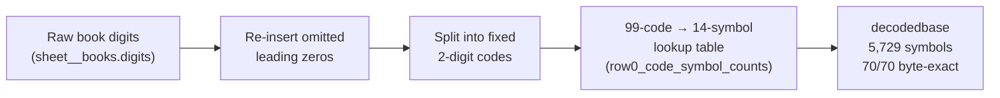

# 2. Data & Method

[← The 469 Puzzle](01-the-469-puzzle.md) · [Wiki home](README.md) · Next: [The Two-Cipher Finding →](03-two-cipher-systems.md)

---

## The databases

All work was done against two SQLite databases (the legacy `.xlsx` workbooks are migration inputs only):

| File | Size | Role |
|---|---|---|
| `data/bonelord_operational.sqlite` | ~1 GB, **1,592 tables** | Canonical interactive state — used for all reads/audits. |
| `data/bonelord_workbook.sqlite` | ~45 GB | Lossless historical archive — queried sparingly. |

> ⚠️ **Note for future work:** the path `data/bonelord_469.sqlite` does **not** exist; querying it fails *silently* in some terminals (errors get swallowed). Always confirm a query returned real rows. Route output to `/tmp` files and read them back.

## Authoritative source of the books

The 70 book digit strings live in **`sheet__books.digits`** (140 rows = two identical rows per `bookid`; dedupe to 70, lossless). Verified integrity (70/70):

- `len(digits) == digitslen` — the stored strings are **complete, not truncated**.
- `len(decodedbase) == baselen`.

## The book decoding mechanism (Layer A)

Each book is decoded **digit → symbol** like this:

1. Re-insert the **omitted leading zeros** (positions in `sheet__booksdigitmodel_v118.omitidxs_1based`; count in `insertedzeros`). The identity **`len(digits) + insertedzeros == 2 × baselen`** holds for **all 70 books**.
2. Read the padded stream as **fixed 2-digit codes**.
3. Map each 2-digit code to **one of 14 symbols** via the table `row0_code_symbol_counts` (99 codes → 14 symbols), producing the `decodedbase` string.

The canonical per-book code stream is in **`row0_code_symbol_probe_books.reconstructed_code_stream`** (space-separated 2-digit codes), with `valid = 1` for all 70 books.

> **Map invertibility (resolved 2026-06-01):** under the canonical code stream the map is **perfectly functional — 99 codes → 14 symbols, 0 ambiguous, 5,729/5,729 positions consistent.** An earlier report of "code 11 → 7 different letters" was an artifact of a *wrong alignment*; it is resolved. Caveat: this is partly **tautological**, because `decodedbase` was *generated* from `row0_code_symbol_counts` — so a clean map proves internal consistency, not that the symbols are the right letters.

## Key tables (quick reference)

| Table | Holds |
|---|---|
| `sheet__books` | raw book digit strings + the project's many translation attempts |
| `row0_code_symbol_probe_books` | canonical per-book code stream, 70/70 valid |
| `row0_code_symbol_counts` | the 99-code → 14-symbol map |
| `sheet__digitlettercodes_auto` | the 14-symbol alphabet |
| `phrase_level_gt_gate_items` | the NPC phrase "ground-truth" gate (see caveat, [page 4](04-phrase-codebook.md)) |
| `rosetta_digit_word_anchors`, `rosetta_wordcode_occurrences` | the phrase word-codes |
| `mathemagic_*` (≈56 tables) | the number/formula hypothesis — all NULL ([page 5](05-book-layer-non-linguistic.md)) |
| `convergence_honest_progress_rollup_v1`, `goal_completion_audit_v1` | the project's own honest scoreboard (BOOK_PROSE_GLOSS = ZERO_ACCEPTED) |

## How claims were verified

Every load-bearing number in this wiki was produced under three disciplines:

1. **Re-derivation from the read-only DB** — not trusting a prior run's stdout (terminal output was intermittently corrupted; numbers were written to files and read back).
2. **Null / control baselines** — a "signal" only counts if it beats the right control. For the book layer the decisive control is a **self-anagram** (shuffle a book's own symbols, keep the multiset): if the real decode does not beat an anagram of itself, the "English" is pareidolia. (See [page 5](05-book-layer-non-linguistic.md).)
3. **Adversarial verification** — a separate agent re-ran the key tests and was instructed to *refute*. It caught and corrected two of our own claims (recorded on [page 8](08-lessons-and-process.md)).

---

[← The 469 Puzzle](01-the-469-puzzle.md) · [Wiki home](README.md) · Next: [The Two-Cipher Finding →](03-two-cipher-systems.md)
