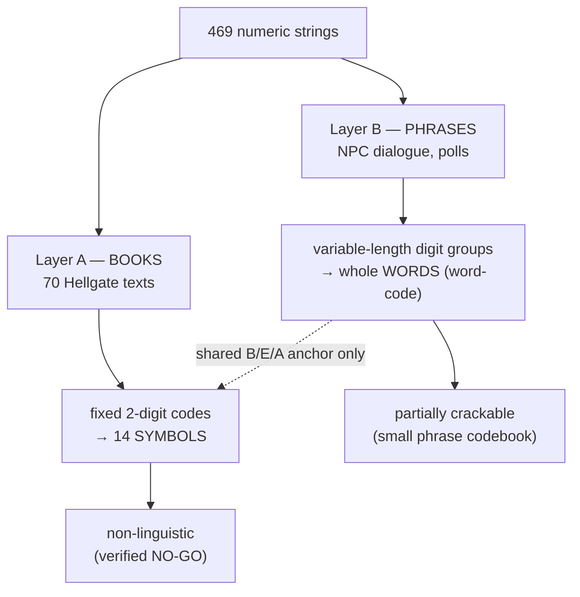

# 3. The Two-Cipher Finding

[← Data & Method](02-data-and-method.md) · [Wiki home](README.md) · Next: [The Phrase Codebook →](04-phrase-codebook.md)

---

> **Core result.** The NPC *phrases* and the 70 *books* are encoded with **two different cipher systems.** This is the single most important structural discovery — and the likely reason a decade of effort plateaued: techniques that work on one layer were being applied to the other.

## The two layers

| | **Layer B — PHRASES** (NPC dialogue, polls) | **Layer A — BOOKS** (the 70 Hellgate texts) |
|---|---|---|
| Unit | variable-length **digit groups** | fixed **2-digit codes** |
| Maps to | one **word** | one of **14 symbols** |
| Example | `3478` → "be", `90871` → "wit" | `34` → B, `78` → E |
| Status | partially crackable ([page 4](04-phrase-codebook.md)) | **non-linguistic** ([page 5](05-book-layer-non-linguistic.md)) |



## How we proved they are different

If the books used the phrase word-codes, then the **long, low-probability** word-codes would have to appear inside book digit strings. They do not.

A Monte-Carlo null (random digit strings matching each book's length) gives the expected number of books containing each code by chance. Observed vs expected:

| Word-code | Length | Books containing it | Expected by chance | Verdict |
|---|---|---|---|---|
| `90871` = wit | 5 | **0 / 70** | ~0.1 | absent (consistent w/ chance) |
| `97664` = than | 5 | **0 / 70** | ~0.1 | absent |
| `653` = look | 3 | **0 / 70** | **~11** | **far BELOW chance** |
| `768` = at | 3 | **0 / 70** | **~11** | **far BELOW chance** |
| `3478` = be | 4 | 24 / 70 | ~1.1 | enriched — but explained below |
| `345` = fool | 3 | 37 / 70 | ~10 | at/above chance |

The decisive rows are `653` and `768`: codes that occur ~11×/70 by pure chance appear **zero** times in the books. A shared system is impossible under that result.

The enriched short codes (`3478`, `345`) are **not** embedded words — they are over-represented because the books are dense letter strings over a skewed 14-symbol alphabet (their digits coincide with high-frequency book symbols). See the frequency profile on [page 5](05-book-layer-non-linguistic.md).

**Verdict: `BOOKS_USE_DIFFERENT_SYSTEM`, high confidence.**

## The partial re-unification (2026-06-01)

The two layers are not *unrelated* — they share a substitution alphabet at the anchor level. Applying the **book** code→symbol map to the **phrase** Knightmare digits:

```
3478 67 90871 97664 3466 0 345   (Knightmare phrase, word-code segmentation = "be a wit than be a fool")
34→B 78→E   67→A   ...            (book 2-digit map)
```

- `3478` = "be" is literally **B + E** (`34`=B, `78`=E).
- The word homophony `be = {3478, 3466}` is explained by **letter** homophony: E = {`78`, `66`}.
- `67` = "a" = the letter **A**.

These anchors are **triangulated across three independent sources**: the book code-map, the phrase word-glosses, and the external tibiasecrets/article160 analysis ([page 7](07-external-sources.md)).

**But convergence stops at the anchors.** After "BE A", the book-map reads the rest of Knightmare as `TEIANBEVF`, which does **not** match "wit than be a fool". So the two layers share the B/E/A substitution but diverge immediately after — the phrase layer is a word-code, the book layer is something else entirely.

---

[← Data & Method](02-data-and-method.md) · [Wiki home](README.md) · Next: [The Phrase Codebook →](04-phrase-codebook.md)
