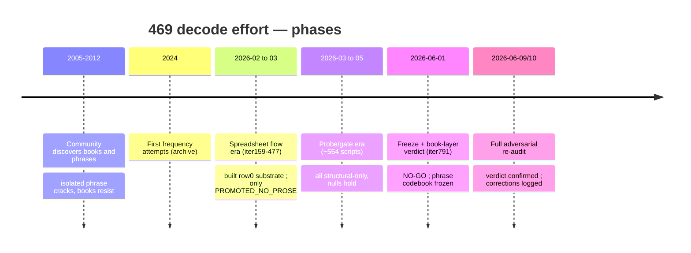

# 6. Attempts & Dead Ends

[← The Book Layer is Non-Linguistic](05-book-layer-non-linguistic.md) · [Wiki home](README.md) · Next: [External Sources →](07-external-sources.md)

---

> A consolidated log of every approach tried over the project's lifetime, and why each was retained or killed. The detailed per-iteration plans live in [`docs/plans/`](../plans/) (67 numbered `iterNNN` files); this page is the map to them.

## Methodology timeline (from the `docs/plans/` series)

The project ran an enormous iterative search. Broad phases visible in the plan files:

| Phase (plan files) | Approach | Outcome |
|---|---|---|
| `iter159`–`iter206` | Early structural/segmentation, base buckets, canon reconstruction | Built the row0 / code-symbol substrate (still authoritative) |
| `iter207`–`iter244` | Semantic lore, **reverse-phrase mining**, English-layer ladders, Tibia corpus fetch | Surfaced the phrase anchors; first "plateau" admissions appear (`iter217`, `iter266`) |
| `iter286`–`iter292` | Sequence/word hints, **sestina methodology** | Structural only; no prose |
| later iters | German-candidate audits, BENNA/anchor families, holdout gates | All `PROMOTED_NO_PROSE` |
| `iter780`–`iter787` | SQLite consolidation, continuous-convergence loop, human-translation routes | Infrastructure; honest plateau diagnosis |
| **`iter791`** (2026-06-01) | **Status reset + book-layer verdict** | This effort — see [the plan](../plans/iter791_status_reset_2026-06-01.md) |

## Approaches tried and their verdicts

| Approach | What it assumed | Verdict | Where |
|---|---|---|---|
| **2-digit → letter homophonic substitution** | books are letter-substitution | map is clean 70/70 but output is **non-linguistic** | [page 5](05-book-layer-non-linguistic.md) |
| **Word-code segmentation of books** | books = phrase word-codes | **refuted** (long codes 0/70) | [page 3](03-two-cipher-systems.md) |
| **German / MHG homophonic (external)** | books = German via 2-digit map | **falsified** (English GT → garbage) | [page 7](07-external-sources.md) |
| **Mathemagic / number system** (≈56 tables) | codes are a numeric formula | **exhausted, all NULL** | [page 5](05-book-layer-non-linguistic.md) |
| **Reduced alphabet / abjad / syllabary** | 14 symbols = compressed English | **closed** (random merge fits better) | [page 5](05-book-layer-non-linguistic.md) |
| **BENNA / TELBENNA / ENNAI as lore words** | these are Bonelord vocabulary | **internal decode artifacts**, no external gloss | below |
| **Reverse-phrase mining / English-layer ladders** | grow cribs from semi-English | produced pareidolia, no accepted prose | `iter207`–`iter244` |
| **Anchored substitution solve (B/E/A fixed)** | remap the other 11 symbols → English | **NO_CREDIBLE_SOLVE** (fails self-anagram as language) | [page 5](05-book-layer-non-linguistic.md) |
| **Known-plaintext attack from phrase cribs (Fork A)** | 2 phrase cribs fit the cipher | data-starved; produced the negative results above | [iter791 plan](../plans/iter791_status_reset_2026-06-01.md) |
| **External book-crib hunt (web)** | someone published a book plaintext | **CLOSED-NEGATIVE** (none exists) | [page 7](07-external-sources.md) |

## The BENNA / TELBENNA / ENNAI dead end (worth its own note)

These strings dominate the book `decodedbase` (Book 0 begins `ITELBENNAIFIININS…`; BENNA appears in 17 books) and the project built dozens of `benna_*` tables around them. The 2026-06-01 sweep confirmed:

- **No Tibia source attests "Benna", "Telbenna", or "Ennai"** (generic web yields only false friends: a *Tebenna* moth, *Talbina* food, a Honkai character). They are **internal decode artifacts** — forced-reading fragments of the non-linguistic book layer.
- The project's own `benna_external_bridge_audit_v1_runs` had already reached this: `exact_external_bridge_count = 0`.
- The closest *real* lore handle is **HONEMINAS** (the Honeminas formula contains 3478) — likely the true origin of the "BENNA_FORMULA_FRAME" label, but the attested name is HONEMINAS, not Benna.

## The pattern across all dead ends

Almost every approach **either** produced structurally-real-but-meaningless operators (`PROMOTED_NO_PROSE`) **or** produced readable-looking English that was **pareidolia** (failed a control). The recurring failure was mistaking *plausible-sounding output* for *signal* — which is exactly what the holdout/anagram controls and the [Outcome Ledger](08-lessons-and-process.md) were introduced to stop.

---

[← The Book Layer is Non-Linguistic](05-book-layer-non-linguistic.md) · [Wiki home](README.md) · Next: [External Sources →](07-external-sources.md)
