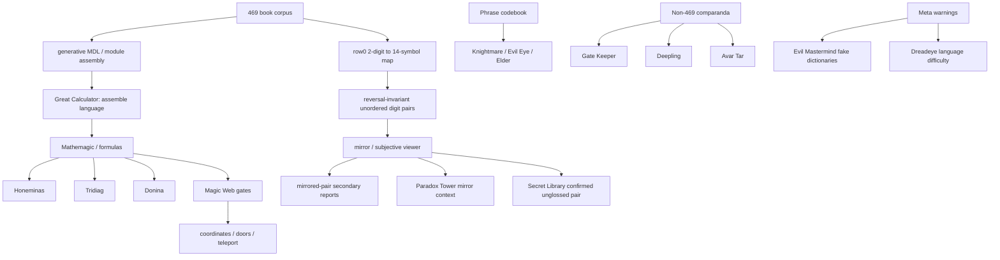

# 10. Lore Source Audit

[<- Open Questions](09-open-questions.md) . [Wiki home](README.md) . Next: [Mechanism & Origin Model ->](11-mechanism-origin-model.md)

---

> Post-final addendum. A 2026-06-18 lore audit reviewed the major unintegrated
> Bonelord/469-adjacent source families and then rechecked the new fronts
> against primary/secondary sources and the raw 70-book digit corpus. It found
> **no new translation, no new CipSoft-attested number<->plaintext pair, and no
> new book crib**. Its value is narrower: it organizes the lore as mechanism
> hypotheses, controls, and watchlist items.

## Core rule

Lore can support four things in this closed case study:

- **Ground truth**: official number<->plaintext evidence. None was found.
- **Mechanism explanation**: a source may fit how the books were produced.
- **Numeric anchors**: unglossed numbers can be tracked, but not translated.
- **Controls/watchlist**: sources can protect against pareidolia or identify
  future official evidence to watch.

Lore **cannot** support a book translation unless it supplies official
number<->plaintext data. That rule is unchanged from the [Outcome Ledger](08-lessons-and-process.md).

## What changed

The final report already closed the plaintext path: the 70-book layer is a
reversal-invariant 2-digit-to-14-symbol mechanism with copy/paste-like
templating, not natural prose.

The lore audit adds a better way to describe the surviving structure:

```text
Great Calculator
-> assemble language
-> formulas / gates / Magic Web
-> pair / mirror / subjective viewer
-> row0 reversal-invariant unordered-pair lookup
-> generative MDL module assembly
```

This is **mechanism support**, not translation progress. If accepted after
controls, it would strengthen the statement "the books were assembled by a
calculated/formulaic process"; it would not produce English, German, or any
other plaintext.

## Ranked fronts

The full registry is in
[`analysis/lore_audit_20260618/00_source_registry.yaml`](../../analysis/lore_audit_20260618/00_source_registry.yaml),
with a generated inventory at
[`analysis/lore_audit_20260618/source_inventory_table.md`](../../analysis/lore_audit_20260618/source_inventory_table.md).
The deeper source/corpus verification is in
[`analysis/lore_audit_20260618/deep_verification_report.md`](../../analysis/lore_audit_20260618/deep_verification_report.md).

| Rank | Front | Class | Status | Translation value |
|---:|---|---|---|---|
| 1 | Great Calculator / "assemble" | Mechanism-lore | `ACCEPTED_AS_MECHANISM_HYPOTHESIS_PENDING_REAUDIT` | none |
| 2 | Honeminas + Tridiag + Donina + Red Light + Magic Web | Mechanism-lore | `REOPEN_AS_GENERATOR_ONLY` | none |
| 3 | Pair/mirror/subjective viewer | Mechanism geometry | `ACTIVE_MECHANISM_AUDIT_SOURCE_VERIFIED_NO_DECODER` | none |
| 4 | Secret Library `74032 45331` | Numeric anchor | `CONFIRMED_UNGLOSSED_EXTERNAL_NUMERIC_BOOK` | none |
| 5 | Paradox Tower mirror/Riddler books | Comparandum | `CONTROL_AND_STYLE_COMPARANDUM` | none |
| 6 | Spirit Grounds / Gate Keeper | Negative comparandum | `CONTROL_NEGATIVE` | none |
| 7 | Evil Mastermind fake dictionaries | Meta-warning | `META_WARNING` | none |
| 8 | Minotaur mages "close to the truth" | Watchlist | `WATCHLIST_CONTEXT_ONLY` | none |
| 9 | Wydrin/Wyrdin madman line | Context | `CONTEXTUAL_EDGE_ONLY` | none |
| 10 | Dreadeye language difficulty | Context | `CONTEXT_ONLY` | none |
| 11 | First Dragon future memoir hook | Watchlist | `WATCHLIST_ONLY` | none |
| 12 | Serpentine Tower sum to 469 | Numerology risk | `LOW_CONFIDENCE_NUMEROLOGY` | none |
| 13 | Hellgate skull matrix | Environmental numerology | `DOCUMENTED_LOW_CONFIDENCE` | none |
| 14 | Imortus fansite/meta item | Low-confidence meta | `LOW_CONFIDENCE_META` | none |
| 15 | Robson architecture note | Environmental context | `DOCUMENT_ONLY` | none |
| 16 | Braindeath / Bonelord Threat | Background lore | `BACKGROUND_ONLY` | none |

## Highest-priority mechanism sources

### Deep verification correction

The second pass changed one source status: `74032 45331` is no longer merely a
secondary report. TibiaWiki BR records it as an untranslated Secret Library Ice
Section book at Mesa 07, added in version 11.80 and related to 469.

That confirmation does **not** make it a key. The direct corpus test found zero
exact hits for `74032`, `45331`, and `7403245331` in the 70 Hellgate-book raw
digit strings. It is therefore a confirmed unglossed external numeric anchor,
not a translation or book crib.

The same check also corrected the Honeminas pair handling: the primary
Honeminas formula contains the vectors `43153` and `34784`; the secondary
s2ward note uses `43151` and `34783`, so that secondary extraction is imprecise.
The primary strings `43153`, `34784`, and `4315334784` also have zero exact hits
in the 70-book raw corpus.

### Great Calculator / assembly

The strongest new framing is the Great Calculator line: someone assisted the
Great Calculator to **assemble** the Bonelord language. That verb fits the
project's final structural finding better than a decoder framing does: the book
layer is cheaper to describe as module inventory plus assembly than as
linguistic text.

Correct status: mechanism hypothesis. It may explain origin or construction; it
does not assign meaning to any book.

### Demona formula family / Magic Web

Honeminas, Tridiag, Donina, Red Light, and Teleportation Through the Magic Web
should not be reopened as plaintext decoders. The prior mathemagic route already
closed with `NO_PLAINTEXT` / `STRUCTURAL_ONLY` outcomes.

They can only be reinterpreted as generator/indexer/selector candidates. Any
future test must be preregistered and checked against formula-null controls.
The key point is that `3478` remains structural: it appears 24 times in 24
books, but as a short overlap already known from the phrase/formula layer, not
as a proven embedded word or book plaintext key. Short values such as `34`,
`99`, `32`, and `20` occur at rates expected for short digit strings and are not
probative.

### Pair / mirror / subjective viewer

This is the best lore-to-mechanism bridge. Pair and observer motifs line up with
the real row0 map property: swapping a code's two digits preserves the same
symbol for nearly all non-palindromic codes, and almost all unordered-pair
classes are pure.

That still does not make a sentence. It describes table geometry.

## Confirmed but weak anchors

The Secret Library pair `74032 45331` is now confirmed as a transcribed external
book, but it is still unglossed and absent from the frozen 70-book Hellgate
corpus. It can be used only as an external numeric-anchor/control case for
pair-geometry hypotheses.

Serpentine Tower, Hellgate matrix material, Imortus, Robson, and Braindeath are
preserved to prevent the same ideas from being rediscovered later, but none has
current evidentiary force.

## Controls preserved

Several sources are valuable precisely because they should **not** be used as
decoders:

- Spirit Grounds / Gate Keeper: weird language plus gates is not automatically
  469.
- Paradox Tower gibberish books: useful as artificial-style comparanda, not as a
  key.
- Evil Mastermind fake dictionaries: in-lore warning against overfit
  dictionaries, matching the project's rejection of plausible but false external
  "solutions."

## Outcome Ledger

The addendum changes no metric:

| Metric | Delta |
|---|---:|
| `CRIBS_REPRODUCED_UNDER_HOLDOUT` | 0 |
| `CODES_CONFIRMED_EXTERNALLY` | 0 |
| `BOOKS_NO_PROSE_TO_ACCEPTED` | 0 |
| `GT_PHRASES_PASSING_EXTERNALLY` | 0 |

No source in this audit provides official book plaintext, an official symbol
table, or a CipSoft-attested phrase gloss.

## Unified relation graph



## Verdict

The exhaustive pass found **one new documentary confirmation** and **no new
translation**. The documentary confirmation is the Secret Library book
`74032 45331`; the negative analytical result is that it does not occur in the
70-book raw corpus and supplies no plaintext.

It did find a better archival framing: the strongest lore sources point toward
an assembled, calculated, formulaic, pair/mirror-dependent mechanism. That
aligns with the already-verified non-linguistic/generative structure of the
books. The follow-up [Mechanism & Origin Model](11-mechanism-origin-model.md)
formalizes that into a 10x10 numeric index table, unordered-pair geometry,
homophone classes, and copied chunk assembly. The project should preserve that
as a mechanism/origin addendum and
continue to treat the only true unlock as new official CipSoft ground truth.

---

[<- Open Questions](09-open-questions.md) . [Wiki home](README.md) . Next: [Mechanism & Origin Model ->](11-mechanism-origin-model.md)
