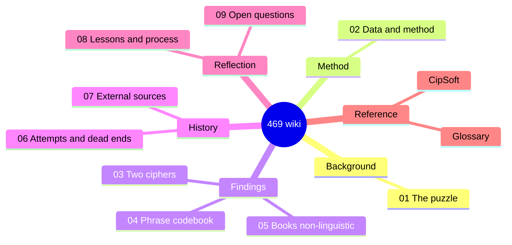

# The Bonelord "469" Cipher — Project Wiki

> A consolidated, navigable record of every approach tried, every result
> verified, and the honest final state of decoding the Tibia Bonelord numeric
> "language" known as **469**.
>
> **Status: CLOSED (2026-06-13).** Two findings are accepted; the book layer is
> verified non-linguistic; the only remaining unlock is external CipSoft ground
> truth. **This wiki is the published record.** The canonical, full-evidence
> document is the **[final report](../469_final_report.md)**; this wiki is its
> browsable, page-by-page companion.

*Not affiliated with or endorsed by CipSoft GmbH; Tibia and Bonelord are
trademarks of CipSoft GmbH.*

---

## What this is

The "469" puzzle is an in-game constructed numeric language spoken by Bonelords
in *Tibia*. The corpus is **70 "books"** (Hellgate / Isle of Kings / Kharos),
each a long string of digits, plus a handful of NPC/poll phrases. This project
tried to decode them. This wiki organizes the entire effort so it can be
understood, audited, and built upon.

## How to read it

Start at the top and follow the path, or jump to what you need:

| # | Page | What it covers |
|---|------|----------------|
| 1 | [The 469 Puzzle](01-the-469-puzzle.md) | What 469 is, the lore, the corpus, why it's hard |
| 2 | [Data & Method](02-data-and-method.md) | The databases, the 70 books, the digit→symbol mechanism, how claims were verified |
| 3 | [The Two-Cipher Finding](03-two-cipher-systems.md) | **Core result:** phrases and books use *different* systems |
| 4 | [The Phrase Codebook](04-phrase-codebook.md) | **Accepted deliverable:** the word-codes that decode the NPC phrases |
| 5 | [The Book Layer is Non-Linguistic](05-book-layer-non-linguistic.md) | **Core result:** the 70 books do not decode to natural language |
| 6 | [Attempts & Dead Ends](06-attempts-and-dead-ends.md) | Chronological log of every approach tried, and why each was retained or killed |
| 7 | [External Sources & Falsified Solutions](07-external-sources.md) | The web evidence, and the German "solution" that was correctly rejected |
| 8 | [Lessons & Process](08-lessons-and-process.md) | The activity-over-outcome critique; the Outcome Ledger reform |
| 9 | [Open Questions & The Only Unlock](09-open-questions.md) | What remains genuinely unknown, and the single thing that could move it |
| — | [Glossary](GLOSSARY.md) | Definitions of the coined terms (Layer A/B, row0, disqualifier, …) |
| — | [CipSoft](entities/cipsoft.md) | The external ground-truth holder — the only thing that could reopen the verdict |

## The bottom line in three sentences

1. **There are two different ciphers.** The NPC *phrases* are a variable-length digit-group **word-code** (partially crackable); the 70 *books* are a separate fixed-2-digit **symbol** system. They are not the same code. → [page 3](03-two-cipher-systems.md)
2. **The phrase codebook is real but small** (10 words; 6 codes attested in-DB + 7 reconstructed; only one code generalizes across phrases) and is validated only against the project's own decoder, not against CipSoft-attested text. → [page 4](04-phrase-codebook.md)
3. **The book layer is verified non-linguistic** — its symbol-frequency profile is closer to flat-random than to any language, its only structure is verbatim cross-book templating, and the mathemagic/number hypothesis is exhausted. No internal method can decode it; only external ground truth could. → [page 5](05-book-layer-non-linguistic.md)

## Reproduce / verify

Every quantitative claim is re-derivable from committed evidence: the audit
scripts and raw outputs are in
[`analysis/audit_20260609/`](../../analysis/audit_20260609/), and the full
reproduction guide (tables, read-only DB, script map) is the
[final report §10](../469_final_report.md). The operational DB is regenerated
from the committed workbooks via [`scripts/`](../../scripts/README.md).

## Canonical & historical documents

- **Canonical:** [docs/469_final_report.md](../469_final_report.md) — the
  definitive document; supersedes all earlier snapshots.
- **Historical (superseded, retained for provenance):**
  [docs/469_frozen_deliverable_2026-06-01.md](../469_frozen_deliverable_2026-06-01.md)
  and the per-iteration plans in [docs/plans/](../plans/README.md). Some figures
  in these predate the 2026-06-09 corrections — trust the final report where they
  differ.

## Provenance & honesty note

Every quantitative claim in this wiki was re-derived from the read-only
operational database and, where it touched the web, checked against the actual
source page. Two honesty corrections made during the work are recorded on
[page 8](08-lessons-and-process.md): the phrase "ground truth" is weaker than
first stated (it is circular against the project's own decoder), and an early
data read was corrupted by a terminal bug and discarded. The work used
adversarial verification at every step; findings that could not survive a
self-anagram / null-baseline control were rejected as pareidolia.
