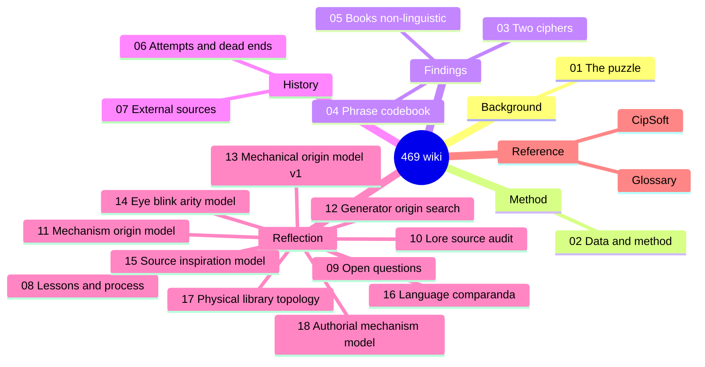

# The Bonelord "469" Cipher — Project Wiki

> A consolidated, navigable record of every approach tried, every result
> verified, and the honest final state of decoding the Tibia Bonelord numeric
> "language" known as **469**.
>
> **Status: CLOSED (2026-06-13).** Two findings are accepted; the book layer is
> verified non-linguistic; the only remaining unlock is external CipSoft ground
> truth. **This wiki is the published record.** The canonical, full-evidence
> document is the **[final report](../469_final_report.md)**; this wiki is its
> browsable, page-by-page companion.

*Not affiliated with or endorsed by CipSoft GmbH; Tibia and Bonelord are
trademarks of CipSoft GmbH.*

---

## What this is

The "469" puzzle is an in-game constructed numeric language spoken by Bonelords
in *Tibia*. The corpus is **70 "books"** (Hellgate / Isle of Kings / Kharos),
each a long string of digits, plus a handful of NPC/poll phrases. This project
tried to decode them. This wiki organizes the entire effort so it can be
understood, audited, and built upon.

## How to read it

Start at the top and follow the path, or jump to what you need:

| # | Page | What it covers |
|---|------|----------------|
| 1 | [The 469 Puzzle](01-the-469-puzzle.md) | What 469 is, the lore, the corpus, why it's hard |
| 2 | [Data & Method](02-data-and-method.md) | The databases, the 70 books, the digit→symbol mechanism, how claims were verified |
| 3 | [The Two-Cipher Finding](03-two-cipher-systems.md) | **Core result:** phrases and books use *different* systems |
| 4 | [The Phrase Codebook](04-phrase-codebook.md) | **Accepted deliverable:** the word-codes that decode the NPC phrases |
| 5 | [The Book Layer is Non-Linguistic](05-book-layer-non-linguistic.md) | **Core result:** the 70 books do not decode to natural language |
| 6 | [Attempts & Dead Ends](06-attempts-and-dead-ends.md) | Chronological log of every approach tried, and why each was retained or killed |
| 7 | [External Sources & Falsified Solutions](07-external-sources.md) | The web evidence, and the German "solution" that was correctly rejected |
| 8 | [Lessons & Process](08-lessons-and-process.md) | The activity-over-outcome critique; the Outcome Ledger reform |
| 9 | [Open Questions & The Only Unlock](09-open-questions.md) | What remains genuinely unknown, and the single thing that could move it |
| 10 | [Lore Source Audit](10-lore-source-audit.md) | 2026-06-18 addendum: Great Calculator, formula, pair/mirror, controls, and watchlist sources |
| 11 | [Mechanism & Origin Model](11-mechanism-origin-model.md) | Production model: numeric index table, pair geometry, homophone classes, and chunk assembly |
| 12 | [Generator-Origin Search](12-generator-origin-search.md) | Formula-generator search: scoring contract, targets, holdouts, front reports, and MDL leaderboard |
| 13 | [Mechanical Origin Model v1](13-mechanical-origin-model-v1.md) | Frozen public summary of the best mechanical fabrication model and plateau |
| 14 | [Eye/Blink Arity Model](14-eye-blink-arity-model.md) | Post-review eye/sprite arity hypothesis tested as mechanism-only, with K5 and 5x2 controls |
| 15 | [Source-Inspiration Model](15-source-inspiration-model.md) | Multi-language source lanes, Knightmare/D&D inspiration, H19-H24 tests, and plateau closure |
| 16 | [Language Comparanda](16-language-comparanda.md) | Tibia conlang/pseudo-language benchmark registry, H25-H30, confidence labels, and controls |
| 17 | [Physical Library Topology](17-physical-library-topology.md) | Hellgate/Isle/Kharos public topology, H-TOP tests, and fine-topology blocker |
| 18 | [Authorial Mechanism Model](18-authorial-mechanism-model.md) | First-principles/Knightmare mechanism prior, literal references, and hierarchical generator improvement |
| — | [Glossary](GLOSSARY.md) | Definitions of the coined terms (Layer A/B, row0, disqualifier, …) |
| — | [CipSoft](entities/cipsoft.md) | The external ground-truth holder — the only thing that could reopen the verdict |

## The bottom line in three sentences

1. **There are two different ciphers.** The NPC *phrases* are a variable-length digit-group **word-code** (partially crackable); the 70 *books* are a separate fixed-2-digit **symbol** system. They are not the same code. → [page 3](03-two-cipher-systems.md)
2. **The phrase codebook is real but small** (10 words; 6 codes attested in-DB + 7 reconstructed; only one code generalizes across phrases) and is validated only against the project's own decoder, not against CipSoft-attested text. → [page 4](04-phrase-codebook.md)
3. **The book layer is verified non-linguistic** — its symbol-frequency profile is closer to flat-random than to any language, its only structure is verbatim cross-book templating, and the mathemagic/number hypothesis is exhausted. No internal method can decode it; only external ground truth could. → [page 5](05-book-layer-non-linguistic.md)

**Post-final lore addendum (2026-06-18):** a systematic review of Great
Calculator, Demona formula/Magic Web, pair/mirror, Secret Library, Paradox
Tower, Spirit Grounds, and other lore fronts found no new translation or
ground truth. The exhaustive follow-up confirmed `74032 45331` as an external
untranslated Secret Library book, but it has zero exact hits in the 70-book raw
corpus. The addendum strengthens the mechanism-only framing: the lore is more
compatible with assembled/calculated/formulaic production than with hidden
plaintext. → [page 10](10-lore-source-audit.md)

**Mechanism/origin addendum (2026-06-18):** the best production model is a
handmade 10x10 numeric index table folded through mirror/unordered pairs, then
fixed homophone classes, then pre-encoded chunks copied into books. This
now has a compiled mechanical formula that roundtrips all 70 raw digit books.
The residual pass then pushes below the old 20-digit module threshold: a
permissive upper-bound explains 100% of literal residual digits, while the
MDL/control-pruned layer keeps only exact short repeats. It explains how the
book layer was likely made; it does not translate it. → [page 11](11-mechanism-origin-model.md)

**Generator-origin search addendum (2026-06-18/19):** the next pass freezes a
scoring contract, target matrix, clue ledger, Chayenne/YTC holdouts, Avar Tar
negative control, and front-by-front reports for grid formulas, Magic Web
vectors, `1 = Tibia`, homophones, zero omissions, module grammar, and seeds.
The constructive pair-table pass adds one mechanical clue: homophone inventory
size strongly tracks internal symbol frequency, while exact pair-cell placement
by source text or lore seed still fails. A symbol-vs-digit origin test then
shows repeated chunks usually preserve exact code sequences, pointing to
copied pre-rendered numeric modules rather than fresh symbol-level rendering.
The module layer now compiles into a stronger tape-based formula: 16 numeric
components, 62 module slices, 12 merged same-component spans, and 70/70 exact
book roundtrip with no plaintext claim. A later endpoint-bridge test finds that
the internal literal bridges do not transfer by adjacent tape/module endpoints
on bridge/book/residual holdouts. The current leaderboard accepts only
mechanical layers and keeps translation delta at zero. The later no-hard-gate
matrix ledger records 294,528 candidates across matrix orders, symbol orders,
lore seeds, anomaly overlays, and weak compositions; the best reaches only
21/55 pair-cell hits and classifies as lookup-disguise. Zero omission remains a
supporting render layer, not the matrix formula. A fixed shared predicate
`i>=j` now links diagonal E pressure with previous-code zero omission (`5/10`
diagonal E, `2/2` 33/66 anchors, joint `p=0.00280`), but it still does not
derive labels or the table. Lore-number phase masks over
`1`, `3478`, Honeminas/Magic Web, and `74032/45331` fail controls. A later
lore-anomaly operator pass also rejects the narrower idea that `469` or the
lore numbers select only the small anomaly sets. A later human-predicate
rule-cover pass reaches 34/55, but shuffles do at least that well, so it is
also rejected as lookup-disguise. A per-symbol predicate/DNF pass reaches
44/55, but costs `4.592x` lookup and is ordinary under shuffles, so it is also
lookup-disguise. A simple algebraic digit-composition pass hits 55/55 only by
creating 55 buckets; its best compact row is 35/55 at `1.535x` lookup. A
marginal-constraint solver finds a weak but real `6<->9` constraint signal
(`0.947x` raw lookup, p `0.00200`), yet it still leaves about `2^141` possible
tables. A hidden digit-order distance pass reaches a
flashier 48/55, but only with 40 groups and higher-than-lookup MDL, and shuffles
also reach 48/55. The latest ordered-surface audit finds a strong rendering
rule: 99/100 ordered codes exist, only `39` is absent, the lower triangle is a
near-perfect mirror of the upper, and the only true directed conflict is
`19 -> I` vs `91 -> N`; this improves the mechanical orientation layer, not
the unresolved origin of the pair-cell labels. A directed sequence-generator
follow-up finds signal only in full/mirror ordered traversals, not in the
upper-only table, so it also reinforces rendering rather than origin. Subsequent row/column balance,
graph-motif, local 2D neighbour-rule, direct coordinate-to-symbol,
line-template, row-transition edit, endpoint-affinity, composite objective,
and joint zero/homophone context probes also reject those as original
cell-placement formulas.
A digit/symbol automorphism pass adds one weak matrix-side clue: swapping
digit identities `6` and `9` preserves 47/55 pair labels and 10/18 moved cells.
A quotient follow-up sharpens that into a tiny lossless compression: 46 orbits,
50 labels, 4 mixed two-cell orbits, and `3.6` rough bits saved vs raw pair
lookup. The quotient inventory pressure is slightly sharper (`L1/slot=0.200`
versus `0.218`), but mixed-orbit overhead removes MDL promotion, and a direct
search over 1,248,362 quotient-coordinate formulas reaches only 16/46 at
`1.741x` quotient lookup. A parallel quotient line/order pass finds nominal
scan structure but still costs more than lookup (`1.550x` for the best line
template). A constructive quotient fill using inventory + order + symbol cycle
beats controls weakly but reaches only 17/46 at `1.700x` lookup. A low-rank
SVD follow-up on the quotient is control-negative (`11/46`, `p=0.56436`), so
the quotient does not rescue the continuous-surface hypothesis. A secondary rule describes the mixed orbits (`x <= 1 or x mod 5 == 3`,
orientation by parity), but controls classify it as a nine-case microfit, so
it still does not generate the labels. A tape-position threshold separates the
same four mixed orbits but also fails 4-of-9 controls. Cell-local hash/PRNG formulas,
set-block/biclique decompositions, visual 6/9 geometries, and digit-signature
formulas were also tested and rejected by MDL/controls. The exact seven-segment
rotation exception set is now identified as anchors `0` and `8`, but two-of-five
controls make it a weak microfit, not a promoted origin rule.
→ [page 12](12-generator-origin-search.md)

**Mechanical origin model v1 (2026-06-19):** the public state is now frozen as
a partial fabrication model, not a translation. Accepted mechanics are the
row0 substrate, unordered-pair/mirror geometry, directed render exceptions,
the 16-tape/62-slice 70/70 formula, MDL-surviving exact residual repeats,
Chayenne as secondary compatibility, and zero omission as a render layer.
Weak clues include `6<->9`, E-layer pressure, orientation/render, and ML's
zero signal. Rejected origin formulas include broad 10x10 matrix searches,
PRNG/seeds, lore-number masks, high-block blocker strokes, and render-origin
E-priority probes. → [page 13](13-mechanical-origin-model-v1.md)

**Eye/blink arity review (2026-06-19):** the post-review hypothesis that
Bonelord eyes could define digit arity was integrated and tested. The arity
match is elegant: `5 eyes -> C(5,2)=10` eye-pair events and therefore 55
unordered two-event cells, exactly the row0 table scale. Actual K5 and `5x2`
tests reject the hypothesis as the pair-cell label formula (`18/55` and
`20/55` best label hits, both worse than lookup after MDL cost). It remains a
mechanism-only lore bridge for arity/orientation, not a semantic decoder.
→ [page 14](14-eye-blink-arity-model.md)

**Source-inspiration model (2026-06-20):** a parallel multi-language source pass
and mechanism-inspiration audit covered official/in-game material, EN/global,
PT-BR/BR, PL, ES/LATAM, DE/other lanes, Knightmare/quest mechanisms, D&D
Beholder parallels, Bonelord Tome, `3478`, `486486`, Secret Library
`74032 45331`, Honeminas/Magic Web, Excalibug, and H19-H24. It found no
`official_gt`, no new plaintext, and no new real formula-discovery direction.
Its value is source hygiene, rejected-claim provenance, explicit blockers, and
controlled watchlist/weak-clue classifications. → [page 15](15-source-inspiration-model.md)

**Language-comparanda addendum (2026-06-20):** a separate pass incorporated
Tibia constructed/pseudo-language material as controls: Jekhr/Deepling,
Orcish, Chakoya, Gharonk, Elven, KAPLAR, spell formulae, and Caveman watchlist
material. Jekhr is the important positive control because it has an explicit
written-symbol to Latin/pronunciation/vocabulary pipeline, but no known Tibia
language is promoted as the 469 key. The result is a future benchmark and
confidence-label registry only; `translation_delta = NONE`. → [page 16](16-language-comparanda.md)

**Physical-topology addendum (2026-06-20):** a public topology pass incorporated
Hellgate overview/bookcase order, Isle shelf 21/39 anchors, and the
Kharos/Ferumbras watchlist. It built a partial Hellgate bookcase manifest and
tested public order/bookcase grouping against row0 similarity shuffles. The
result did not promote a topology mechanism (`translation_delta = NONE`);
fine-grained tile/slot/orientation/read-order evidence remains blocked.
→ [page 17](17-physical-library-topology.md)

**Authorial/mechanism addendum (2026-06-20):** a first-principles Knightmare
design report was integrated as a mechanism-search prior, not an intent claim.
It reinforces the small phrase-code plus mechanical book-layer model and adds
one mechanical improvement: a literal-reference tape formula that replaces 36
remaining literal items with existing tape-component references, saves roughly
`1167.4` bits under the local screen, survives component-shuffle and
random-literal controls, and still roundtrips 70/70 books. A follow-up
hierarchical formula reconstructs the tape inventory by self-reference and then
renders all books, reaching roughly `13858.5` bits with 16/16 component and
70/70 book roundtrip. A direct provenance-to-pair-table audit rejects the same
features as row0 origin (`16/55`, control `p=0.4194`). A later sequential LZ
book formula tightens the copy/reference upper bound to roughly `10190.0` bits
with 70/70 roundtrip; arbitrary non-numeric book orders are not promoted after
charging permutation cost. Re-costing the same generator with literal runs
instead of per-digit literal flags tightened the mechanical upper bound at that
stage to roughly `9944.0` bits. A dynamic-programming parse under the same
run-literal vocabulary tightens it further to roughly `9823.3` bits, still
with translation delta zero. Follow-up address models do not improve it, but
the committed copy graph/literal atlas now records source hubs and literal-seed
reuse. Structured public Hellgate/bookcase orders were tested under DP LZ and
do not beat numeric order. Literal-seed addressing is not promoted because
mode bits erase the apparent gain; grouped mode coding narrows but does not
reverse that result. Copy-hub macro ledgers are also worse than absolute
`source_pos`. A restricted motif-dictionary reparse roundtrips 70/70 but does
not beat the DP LZ baseline. Sweeping the DP `min_len` parameter keeps
`min_len=6` as the best tested setting under gamma length coding. Replacing
gamma copy-length coding with Rice `k=4` and reparsing at `min_len=5` improves
the current mechanical upper bound to roughly `9596.5` bits; a broader
length-code grid retains that setting. Retesting address ledgers on the Rice
parse keeps absolute `source_pos` as the best decodable source ledger.
Re-encoding literal-run lengths with Rice `k=3` improves the current bound
again to roughly `9545.5` bits, and a joint length-code grid retains that exact
parameter set. Adaptive literal-payload coding lowers the bound again to
roughly `9538.0` bits without changing the recipe; retesting address ledgers on
that formula keeps absolute `source_pos` as the best decodable source ledger.
A one-step literal-to-copy repair lowers the current bound to roughly `9537.3`
bits, a post-repair payload alpha sweep retains `alpha=14`, and a post-repair
address retest again rejects literal-seed addressing as optimistic-only. A
compatible pair-repair search also fails to improve on the one-step repair.
Replacing independent gamma-coded book lengths with a declared signed-Rice
residual ledger then lowers the mechanical bound to roughly `9073.3` bits; a
multi-anchor length ledger is tested and rejected after mode costs. Recompiling
copy addresses over the digit-only stream lowers the bound again to roughly
`9070.8` bits; alternate digit-only address ledgers are retested and rejected.
A digit-address local repair lowers the bound again to roughly `9070.1` bits.
The follow-up payload alpha and address-model sweeps retain the current
parameters. Encoding the fixed literal/copy item-type stream with a declared
adaptive two-symbol ledger lowers the bound again to roughly `8996.2` bits,
and Markov/book-start item-type ledgers lower it further to roughly `8972.2`
bits. A charged deterministic literal-to-copy item rule lowers it again to
roughly `8966.7` bits, and a second rule for too-short book suffixes lowers
it to roughly `8953.9` bits. Removing redundant forced short-suffix literal
length bits lowers it further to roughly `8922.9` bits, and one final
forced-length local literal-to-copy repair lowers it to roughly `8922.8` bits.
The post-repair payload alpha sweep retains `alpha=14`; the post-repair address
retest keeps absolute `source_digit_pos` as the best decodable ledger; a
compatible pair-repair search, triple search, and quartet search are still
worse than the active formula. The remaining high-order local repair frontier
is now closed: sizes `13..19` are worse and sizes `20..22` have no compatible
sets. A final literal-payload context audit improves the mechanical bound to
roughly `8842.0` bits by coding literal digits from the previously emitted
digit, and a context-order sweep lowers it again to roughly `8805.7` bits with
a declared order-2 previous-emitted-digit context. An item-type context-order
sweep lowers it to roughly `8803.5` bits, and one contextual copy-to-literal
repair lowers it to roughly `8803.1` bits. The immediate local frontier after
that repair is closed, and the current address-model retest keeps absolute
`source_digit_pos` as the best decodable address ledger. A post-contextual
parameter resweep keeps copy Rice `k=4`, literal Rice `k=3`, payload order `2`
/ `alpha=1`, and item-type order `3` / `alpha=2` as the active parameter
frontier. A bounded copy-length compile then replaces unbounded Rice copy
lengths with a decodable truncated-binary code over the legal length range
known after the source address is decoded, lowering the active mechanical bound
to roughly `8614.1` bits. A min_len-bounded address pass then excludes
impossible final source positions and lowers it slightly again to roughly
`8613.1` bits. A local repair retest under that cost model turns literal
`11216` in book `2` into a prior copy and lowers the bound to roughly
`8611.4` bits. A follow-up local repair turns `45765` in book `34` into a prior
copy and lowers the bound to roughly `8609.8` bits. A further one-step local
frontier pass closes that immediate repair space, and a parameter resweep
retains the current declared settings. A compatible-pair local frontier also
closes; a post-repair2 address-model retest keeps the absolute minaddr ledger
as the best decodable address model, and a copy-order retest keeps source-first
coding as the best decodable within-copy order. An adaptive bounded copy-length
ledger then lowers the strongest mechanical bound to roughly `8576.0` bits;
the immediate local recipe frontier closes again under that scorer, and the
post-adaptive parameter resweep retains the declared settings. The compatible
pair frontier also closes under the adaptive scorer, and the post-adaptive
address retest keeps absolute minaddr as the best decodable address ledger. The
post-adaptive copy-order retest also keeps source-first coding. A fixed
book-midpoint context for adaptive copy lengths then lowers the mechanical
bound to `8574.407` bits; the immediate local frontier after that refinement
closes again. A post-midpoint parameter resweep lowers the bound to `8572.267`
bits by changing copy-length `alpha` from `2` to `1`; the immediate local
frontier and compatible-pair frontier after that alpha change close again. A
post-alpha1 address retest keeps min_len-bounded absolute addresses as the best
decodable ledger; literal-seed addressing remains an optimistic-only lower
bound. A post-alpha1 copy-order retest keeps source-first as the best decodable
order; length-first variants remain optimistic-only or worse after mode costs.
The post-alpha1 copy-length context resweep also keeps the fixed book-midpoint
context as the best fully declared context, and the context-specific alpha grid
keeps shared `alpha=1`. A literal-payload context search keeps the global
previous-emitted-digit payload model. A bounded top60 triple probe also fails
to improve the formula inside its declared scope. An item-type context search
then promotes a declared split at book `6`, lowering the active bound to
`8569.652` bits. A post-itemctx parameter resweep then promotes item-type
extra-context order `1` / `alpha=2`, lowering the active bound again to
`8561.792` bits. The subsequent local and compatible-pair frontiers close
again, with the best one-step edit `+0.957` bits worse and the best pair
`+1.809` bits worse. Post-itemctx_param address and copy-order retests also
remain optimistic-only: literal-seed no-mode reaches `8492.396` bits but the
best decodable seed-run ledger is worse, and mixed copy order needs free mode
bits. Post-itemctx_param copy-length context and alpha-grid retests also retain
the fixed midpoint `alpha=1` model. Literal-payload context retesting keeps the
global previous-emitted-digit payload model. A broader item-type context family
sweep also keeps the active split `6`, order `1`, alpha `2` model. A joint
payload/item-type context sweep keeps the same active pair after checking
`1310848` combinations, and a copy-length/item-type context sweep keeps it
after checking `1344896` combinations. A triple payload/copy-length/item-type
sweep closes `103556992` implied combinations by component minima, and a
copy-length alpha/item-type sweep closes `69747328` implied combinations. A
copy-length alpha/payload sweep closes `315469` implied combinations. The
copy-alpha/payload/item-type triple sweep closes `5370544256` implied
combinations by component minima. The copy-length context/shared-alpha resweep
tests `5056` rows and retains the active book-midpoint `alpha=1` context. The
literal-payload context/shared-alpha resweep tests `4928` rows and retains the
active global `alpha=1` payload model. The copy/payload context-alpha pair
search closes `24915968` implied pairs by component minima. The
copy/payload/item context-alpha triple search closes `424169439232` implied
triples by component minima. The address/copy-order pair search closes `50`
pairs and retains the active decodable copy-cost ledger; the only better row is
nondecodable. The address/item-type pair search closes `170240` pairs and also
retains the active decodable pair. The address/payload context-alpha pair search
closes `49280` pairs and also retains the active decodable pair. The
prequential audit then froze the prior `8561.792` as `compression_bound`; learned
components beat uniform on all prefix/holdout cuts, but this remains partial
predictive validation rather than row0 origin or final authorial method. No
semantic claim is promoted.
The prequential order control adds that numeric prefixes are not special:
random same-size train-book sets usually save more bits, so the signal is
`prequential_predictive_not_numeric_order_specific`.
The component ablation audit then keeps copy-length midpoint as predictive but
simplifies generation explanation toward literal payload order-1 and item-type
split-only, leaving the compression bound unchanged.
The simplified generation profile compile then measures that profile at
`8613.581` bits with `70/70` roundtrip, useful as explanation but not as a
lower MDL code.
The item-type split-only compile then promotes the split-only item-type
component itself, lowering the active bound to `8558.667` bits with `70/70`
roundtrip and no semantic claim.
The split-only alpha resweep retains `alpha=2`; `alpha=1` is the nearest
alternate at `+0.309` bits.
The item-type/op-shape boundary gate keeps that split-only item-type stream
while deriving compact-recipe op `type` fields from operation shape.
The prequential and row0-origin audit freezes `8558.667` as
`compression_bound`: learned components beat uniform on prefix future-suffix
splits, but random same-size train controls are usually stronger, and row0
origin remains exogenous.
The recipe-externality audit quantifies the boundary: `4285.876/8558.667`
bits are actually prequentially scored learned components, while `4272.791`
bits remain fixed-recipe or non-learned ledger extracted from the full formula.
The recipe-reparse evidence matrix reduces that limitation: deterministic
reparse roundtrips all prefix-held-out suffixes and beats active suffix recipes
plus content controls, while still rejecting the stronger claim that numeric
prefix training is uniquely authorial because random same-size train inventories
can match it at cutoff `50` (`p=0.1538`). A multi-cutoff train-set control
extends that boundary to cutoffs `35/50/60`: numeric prefix wins against
random-train mean/max at `2/3` cutoffs and loses at cutoff `60`.
Public-bookcase family holdout strengthens the recipe-discovery side:
deterministic reparse beats raw digits in `19/19` families and `3/3`
component-failure families, while beating the active frozen recipe in `14/19`.
A family-loss decomposition then localizes the five remaining active-recipe
wins: all roundtrip and beat raw digits; four are dominated by copy-address
overhead, and one is an exact tie.
A same-coordinate address-space audit then shows those copy-address losses are
comparison artifacts: repricing the active recipe in the heldout-after-train
coordinate system drops the mean address delta from `4.667` bits to
approximately `0.000` bits.
Applying that correction to all public-bookcase families changes the
reparse-vs-active beat/tie coverage from `15/19` to `19/19`, while preserving
`19/19` raw-digit wins.
The online order frontier control then sharpens the order boundary: numeric
order keeps `69/69` after-bootstrap raw wins, but the same criterion is not
unique because `10/11` tested orders pass, including `6/6` seeded random orders;
`random_04` is `+0.549` bits better in mean after-bootstrap gain and `+61.452`
bits better in total gain. The online frontier remains predictive-parser
evidence, not numeric-order proof.
The follow-up promotion gate then prevents that local frontier result from
being misread as a formula improvement: `random_04` is `+188.584` bits worse
than numeric under the complete online formula before order cost and `+521.038`
bits worse after descriptor cost, with no promotable non-numeric order.
A no-test-carryover family variant still beats raw digits in `19/19` families
when each held-out book starts only from the training-complement inventory.
A singleton leave-one-book-out audit then beats raw digit coding in `70/70`
books using only the other `69` books as inventory, with minimum gain
`96.055` bits.
A source-attribution follow-up maps `11062` singleton copied digits to source
books/current prefix and exposes a caveat: `3001` copied digits cross
artificial source-book boundaries in the concatenated complement inventory.
A book-bounded singleton reparse then forbids those crossings and still beats
raw digits in `70/70` books, with mean gain `464.898` bits.
A family-excluded singleton reparse also removes same-family public-bookcase
books from train counts and copy sources; it still beats raw in `70/70` books
and in `46/46` family-labeled books, with mean gain `460.251` bits.
An online prefix book frontier audit then tests true previous-books-only
generation per target book: the book-bounded variant beats raw in `69/70`, with
only the cold-start book `0` failing, and beats raw in `69/69` after bootstrap.
Charging book `0` as one explicit raw seed then closes that local failure as a
bootstrap policy: `70/70` wins-or-ties, `69/70` strict wins, and no new
compression-bound or authorial-proof promotion.
A full formula rescore confirms the caution: the seeded formula is `+0.979`
bits worse than the existing `8343.062`-bit online formula, so the seed remains
bootstrap accounting rather than a promoted formula.
The loss decomposition explains why: non-payload components save `36.842` bits,
but literal payload adds `37.821` bits.
Exception signaling closes the seed path: a zero-cost deterministic fallback is
already `+0.979` bits worse, and any nonnegative descriptor makes it worse.
The row0 requirement-matrix follow-up closes the requested hypothesis checklist:
six origin families have explicit algorithm/cost/coverage/control entries, and
promoted row0-origin formulas remain `0`.
The recipe reparse audit strengthens that result: with frozen train-prefix
component counts, a deterministic LZ parser roundtrips every future suffix and
beats the active full-corpus recipe under the same frozen counts, while still
remaining split-specific analysis rather than a new bound.
The reparse controls then show this is not generic behavior on same-length
random or shuffled decimal strings: controls lose against raw digits while real
suffixes keep large positive gains.
The train-set control keeps that boundary honest: numeric prefix training beats
the random train-set mean at cutoff `50`, but does not beat every random
inventory, so numeric order is not promoted.
The online deterministic reparse compile turns that parser into a full-corpus
formula, lowering the bound to `8343.062` with `70/70` roundtrip; it still makes
no row0 or semantic claim.
An order-control audit then supports the compact numeric order: reverse,
parity, length-derived, and 6 seeded random orders all cost more; the best
random raw order is `+188.584` bits worse before arbitrary-order charge.
A recipe-prune audit then marks book `length` and copy `target_start` as
derivable representation fields; removing them in-memory keeps `8343.062` and
`70/70`, leaving literal payload plus copy source/length as real dependencies.
The canonical online recipe compile materializes that stripped representation
as the compact current formula file, still with no semantic or row0 change.
The literal-length-derived compile removes literal op `length` as an independent
field; copy `length` remains declared.
The op-type-derived compile removes explicit op `type`; field shape now
distinguishes literal from copy.
The recipe representation dependency gate consolidates those compiles: `766`
independent fields are derivable, while literal text, copy source, and copy
length remain declared dependencies.
The copy-source canonicality audit shows all copy sources are earliest legal
occurrences of their copied chunks; source is canonical for encoding but still
required for decoding.
The source canonicality decodability gate makes that limitation explicit:
earliest-source canonicality is `261/261`, but the rule depends on future
target text, `138/261` choices remain ambiguous at declared length, and source
is not removed from the decoder.
A control addendum supports that tie-break: latest occurrence reaches only
`123/261`, previous-source-plus-length only `5/261`, and random candidate
choice would expect `169.473` hits.
The source-selection derivation boundary gate then rejects turning that
canonicality into decoder derivation: the earliest rule needs future target
text, backward distance is `+25.551` bits worse, and the best state-free default
is `+15.186` bits worse.
The copy-length default/exception audit then remodels copy length: the
target-max rule is mostly true but encoder-only, while a decodable
`decoder_max_possible` default plus adaptive exceptions lowers the mechanical
bound to `8206.178` bits without changing row0 or semantics.
The copy-length derivation boundary gate then keeps the distinction explicit:
target-max matches `238/261` but is encoder-only, and compact recipes still
declare all `261` copy lengths.
The copy-source default/exception audit then remodels source addressing with a
decodable previous-source-plus-length default plus global adaptive exceptions,
lowering the mechanical bound to `8177.317` bits while leaving row0 and
semantics unchanged.
The default/exception prequential validation audit keeps that boundary honest:
after the train-count freezing fix, prefix online and frozen gains stay
positive (`min frozen aggregate=50.303` bits), but family holdouts include
failures. A component-profile compile then records the split explicitly:
`8177.317` bits is both the then-current `compression_bound` and
prefix-frozen generation profile for this layer, while the generation claim
remains partial under
family/bookcase holdout.
The copy-source distance audit then rejects a decodable backward-distance
source model: replacing the active absolute-source default/exception model
would cost `+25.551` bits.
The current active prequential profile audit then consolidates copy length,
copy source, literal payload, and item type under the then-active `8177.317`
bit formula. The learned streams account for `7157.317` bits (`87.526%`) and beat
uniform in every tested prefix, block, and public-bookcase family holdout, but
random same-size train controls are usually stronger than numeric prefixes.
This strengthens component validation while leaving recipe discovery, row0
origin, and semantics unchanged.
A current-active-profile boundary gate consolidates that result: the profile is
validated across tested splits, but exact active reparse remains blocked by
previous-copy source/length state.
A copy-source state compression gate then reduces that blocker: the source
default only needs `previous_copy_end`, preserving the ledger while reducing
the aggregate candidate-state proxy by `97.239%`; no full parser is promoted.
The active-reparse feasibility follow-up narrows the next implementation
frontier: all tested book-level end-state proxies are below `1,000,000`, and
cutoff `60` has `9/10` books below `250,000`, but the complete active parser
is still not promoted.
A cutoff-60 prototype then reprices deterministic reparse recipes with the
active `previous_copy_end` source ledger: `10/10` roundtrip, `10/10` raw wins,
and `-10.241` aggregate bits versus uniform-address reparse, while only `4/10`
books improve individually and no recipe reoptimization is promoted.
The same repricing generalizes across cutoffs `10/20/35/50/60`: `5/5` cutoffs
beat uniform-address reparse in aggregate, totaling `-112.968` bits, but this
still reprices existing deterministic recipes rather than discovering
source-state-optimal recipes.
A fixed-segmentation source-choice optimizer then changes `0/514` sources and
adds `+0.000` bits versus repricing, closing the simple local source-only
improvement path.
A global fixed-segmentation source-path DP then changes `10/514` sources and
improves the repriced ledger by `-42.359` bits with max state count `14`,
confirming path-state value while still leaving segmentation and copy lengths
fixed.
A full-corpus fixed-recipe source-path formula gate then verifies the same idea
under the real adaptive source-stream rescore: changing `2/261` source
positions lowers the active mechanical bound from `8177.317` to `8162.412`
bits, while segmentation and copy lengths remain fixed.
A single/pair source-substitution frontier then searches `376` singles and
`69849` pairs exactly under adaptive rescore; the best pair lowers the active
mechanical bound again from `8162.412` to `8160.827` bits. Triples and higher
source-substitution orders remain unsearched.
A second pass over that same frontier finds only a microscopic `+0.000671` bit
gain, moving the bound to `8160.826421` bits. This is recorded as a
compression-bound update, not stronger generation evidence.
A third pass still finds a positive pair, but only `+0.000503` bits, moving the
bound to `8160.825917` bits and indicating local source-frontier saturation.
A fourth pass adds only `+0.000310` bits, moving the bound to `8160.825608`;
this further supports local source-frontier saturation.
A source-substitution saturation audit then freezes repeated same-chunk local
source micro-sweeps as no longer mainline: the last three gains sum to only
`0.001484` bits and are dwarfed by selector-cost sanity checks.
The active reparse state-boundary audit then localizes the recipe-discovery
blocker: the current copy-source default is path-dependent on previous copy
source plus length. Exact active reparse needs an expanded previous-copy state,
with a cutoff-10 state proxy of `302879952`, so no active reparse parser is
promoted yet.
The copy-source state-free default audit rejects the direct simplification:
the best decoder-computable default that avoids previous-copy state is
`state_free_back_current_length`, still `+15.186` bits worse and worse in every
prefix frozen split. The path-dependent source state remains the active
recipe-discovery boundary.
A source-state dependency gate consolidates the negative result with the
canonicality check: earliest-source canonicality does not make source
decoder-computable, and state-free defaults fail to remove the expanded
previous-copy source/length state (`5/5` prefix-frozen losses).
The copy-length midpoint context gate then supports the active `book_id < 35`
split as component validation: midpoint beats global by `13.839` stream bits,
ranks second among 69 one-cut boundaries, wins every prefix frozen split, and
passes book-id permutation controls (`p=0.0033`). The searched cutoff `37` is
not promoted for only `0.256` bits over the natural midpoint.
The literal copy availability boundary audit narrows the remaining literal
recipe dependency: `73/87` literal starts have no legal `min_len` copy
candidate, and `760/857` literal digits are forced at digit level. The residual
choice frontier is now localized to `14` literal starts and `97` literal digit
positions where copy candidates exist.
A literal availability gate consolidates the repair checks: `74` in-literal
and `465` cross-op candidate repairs are all worse, with best deltas `+1.180`
and `+0.027` bits. Literal externality is reduced, not removed.
The optional literal copy repair frontier then checks the simplest repair:
single in-literal copy-prefix substitutions for eligible optional starts. It
scores `74` candidates across `5` starts; none improves, and the best remains
`+1.180` bits worse under the active ledger.
The cross-op optional literal copy frontier then allows those replacement
copies to consume following operations. It scores `465` valid candidates; none
improves, and the best is only `+0.027` bits worse than active.
The cross-op near-tie decomposition explains that best miss: literal/item
savings are nearly canceled by copy-length/source costs, with copy source alone
adding `+11.237` bits. The tiny loss is real, not rounding noise.
The cross-op source break-even audit shows why it still cannot be promoted:
the candidate source is earliest among two full-length occurrences, but this is
only encoder-side unless source can be derived during decoding. The active
source ledger sits `0.027` bits above break-even.
The copy-source structural context audit then rejects simple context fixes for
that source ledger: book-half is the best non-global context but is still
`+5.872` bits worse, and it loses every prefix-frozen split.
The source blocker structural context gate folds those two checks together:
the near tie is only `+0.027` bits worse and a source-free oracle would be
`-11.209`, but the best decodable simple context is still worse in full corpus
and in `5/5` prefix-frozen splits.
The current literal-payload profile audit then rejects carrying forward the old
order-1 simplification: on the current recipe, order-1 is `+95.968` bits on
the full corpus and `+28.609` bits worse in aggregate frozen prefix tests.
The literal-payload default/exception audit then rejects modal-default literal
digit coding: the active categorical previous-emitted-digit order-2 model stays
best, so no literal-payload fallback is promoted.
The literal-payload structural context audit also rejects literal-run offset,
run-length bucket, and book half/parity contexts as over-splits.
The literal-payload model gate then retains the same order-2 payload boundary
after forced literal availability is separated: order-1, modal default/exception
coding, and simple structural contexts all remain worse.
The row0 origin frontier audit then indexes matrix/rule/orbit/tape-feature/
low-rank/render/eye/provenance tests and classifies that front as
`row0_origin_frontier_saturated_current_corpus`: row0 remains open, but no
charged controlled pair-label formula is available in the current corpus.
A paid-anchor follow-up tests the best partial worksheet shape directly: all
13 anchors save `54.178` bits only before costs; after explicit pair+label
cost the net is `-11.852` bits. Rare-singleton anchors are nominally strong
under random controls but merely break even once their rare labels are paid.
The row0 parallel provenance bridge then traces local workbook/import/
reconstruction/audit layers but leaves CipSoft origin untraced, so row0 remains
a substrate assumed by the book generator rather than a derived component.
The latest row0 compatibility gate keeps that boundary unchanged after the
`8154.676268` partial-boundary promotions: the improvement is downstream book
formula only, with no row0-label holdout predictor, paid lookup reduction,
surface-clue derivation, or new provenance.
The final formula dependency refresh then checks whether the lower bound also
changed the structural source/length frontier. It did not: target-max coverage
stays `242/261`, declared-source+decoder-max stays `60/261`,
unique-source+decoder-max stays `28/261`, previous-end+decoder-max stays
`1/261`, and retained operation dependency fields remain `609`.
The final parser feasibility audit then scopes the next implementation path:
all tested book-level previous-end state proxies are under `1,000,000`, but the
copy-transition proxy still totals `1,966,897,365` transitions (`23045.1x` old
DP), so the parser must be pruned/cached and attacked per book rather than as a
naive whole-suffix DP.
The first book-local parser probe executes that path on cutoff-60 books `67`
and `60`: both roundtrip and beat raw digits, totaling `125.866` parser bits
and `8,423,281` transition evaluations. It is implementation progress, not a
bound promotion, because it ties the same-policy reprice comparator and leaves
book `66` as the immediate hard case.
The sparse hard-book parser gate then removes that immediate blocker: book `66`
roundtrips under sparse Dijkstra in `0.033s`, with `41,832` transition
evaluations versus the prior `26,096,904` transition proxy. This is still a
book-local parser result, not a corpus-wide generator promotion.
The post-parser row0 compatibility audit then consolidates the dependency and
parser gates against the independent row0 front: the recent advances do not
predict row0 labels under holdout, beat paid row0 lookup, explain `39`/`93`/
`19/91` beyond the existing surface clue, or add CipSoft/authorial provenance.
The result is `row0 unchanged`.
The cutoff-60 sparse suffix parser gate then executes the parser over all
books `60..69` in order, carrying `previous_copy_end` between books: `10/10`
roundtrip, `10/10` raw-positive, `368.531807` parser bits, and `383,548`
transition evaluations. It ties the same-policy reprice, so this is parser
execution progress rather than a new compression bound.
The multi-cutoff sparse suffix validation then repeats the same parser at
cutoffs `10/20/35/50/60`: `175/175` suffix book evaluations roundtrip and
beat raw digit uniform, and parser vs same-policy reprice is `12/163/0`
better/tie/worse with a `-12.180052` bit aggregate validation delta. This
strengthens predictive parser evidence, while still not promoting a new bound
because the validation cuts overlap.
A path-stability follow-up then distinguishes reusable parser structure from
prefix-sensitive choices: among `50` books seen under multiple cutoffs, `38`
keep one exact operation signature and `12` vary; book `65` is the worst case
with `4` signatures. That makes the remaining frontier concrete: explain or
stabilize the prefix-sensitive paths before calling this a final generator.
The unstable-path decomposition then classifies the `12` prefix-sensitive
books: `9` are same-shape boundary shifts, `3` are segmentation-shape changes,
and none is pure source-address drift. The next structural blocker is
copy-boundary selection, especially book `65`, not another source-address
micro-sweep.
A boundary-policy stability gate then rejects the cheap shortcut: fixed simple
boundary policies over the `12` unstable books and `37` cutoff observations do
not stabilize the paths. The best structural rule reaches only `16/37` exact
matches with `8.984788` regret bits, and even the audit-only average-reprice
oracle reaches only `18/37`.
A boundary-instability cost decomposition then compares `47` losing observed
variants against their per-cutoff parser winners: `copy_length` is dominant in
`30` comparisons, `copy_source_exception` in `12`, `literal_payload` in `4`,
and `copy_source_flag` in `1`. The blocker is now localized to learned
copy-length/source-exception costs, with payload pressure concentrated in a few
segmentation-shape cases.
A component-neutralized stability gate then tests the simplification directly:
uniform decodable copy-length and source-exception costs improve exact
multi-cutoff path stability from `38/50` to `48/50` while preserving `175/175`
roundtrip/raw-positive evaluations. The cost is `+67.605622` parser bits and
residual instability in books `26` and `34`, so this is a generator-explanation
candidate, not a compression-bound promotion.
A residual tradeoff audit then shows why that candidate is not final: it
resolves `11/12` active learned-path instabilities, but book `34` persists and
book `26` is newly introduced. Uniformizing the full source model changes the
residual pair to `35`/`45` at another `+367.448154` bits over the best
neutralized mode, so source-flag uniformization is rejected as the next
simplification.
A residual literal-payload neutralization gate then moves the frontier again:
uniform literal payload resolves books `26` and `34`, improves exact path
stability to `49/50`, and preserves `175/175` roundtrip/raw-positive
evaluations. It costs `+170.606311` parser bits over the previous neutralized
mode and introduces book `49` as the single remaining residual, so it is still
not a final generator.
The book `49` residual split audit localizes that last instability: cutoffs
`10/20` split the prefix as `literal 11 + copy 7 + literal 7`, while cutoff
`35` keeps a coalesced `25`-digit literal. Removing local `literal_length` or
`item_type` charge makes the split-prefix variant win in all three cutoffs, but
this is audit-only rather than a corpus-wide rule.
A global item/literal-length control gate then applies those local controls to
the full multi-cutoff parser set. Removing `item_type` charge closes exact path
stability at `50/50`; removing both `item_type` and `literal_length` also reaches
`50/50` and gives the best parser-bit delta (`-770.657134` versus the
payload-uniform baseline), with `175/175` roundtrip/raw-positive evaluations.
This is parser-stability progress only: `row0 unchanged`, no compression-bound
promotion, and no semantic claim.
A stable path projection boundary audit then tests the promotion boundary. The
best stable no-item/no-literal-length projection covers `11263/11263` digits
after 10 seed books, with `208` copy items, `54` literal runs, and `265` parsed
literal digits, reducing materialized operation dependency fields by `139` versus
the active formula. It still requires target text for copy candidates, literal
payload, and literal endpoints, so it remains an encoder-side projection rather
than a promoted decoder-side generator.
A decoder-side rule coverage audit then tests simple source/length rules against
that projection. The best source rule covers `6/208` copy events, the best
length rule covers `58/208`, and the best joint rule covers only `2/208`; the
decoder-max length signal beats shuffled-length controls but is far from a full
generator, with `265` literal payload digits still materialized.
A source tie-break artifact audit then checks the `208/208` earliest-target-match
source signal directly. Alternate source tie policies keep identical primary cost
and `50/50` stability, but do not change selected source sums, so the signal is
not reduced to simple parser ordering. It remains target-dependent because the
target chunk is still needed to select the match.
A source candidate collapse audit then supersedes that source-canonicality
reading: `precompute_matches` keeps only one source per length and chooses the
lower `source_pos`, so later same-length sources never reach the parser heap.
`130/208` projected copy events have hidden alternate sources. The
earliest-target-match signal is therefore a candidate-generation artifact, not
independent source evidence.
A full source exposure audit then reruns the corrected parser on cutoff `60`.
All three tie policies remain stable and roundtrip over `10/10` books; the
`latest_source` policy selects `10` non-earliest sources at only `+0.017676`
primary bits versus collapsed, while the other two policies match collapsed cost.
This is local parser robustness, not source-rule promotion.
A full-source latest multi-cutoff probe then tests cutoffs `50/60` under that
same disruptive policy. It roundtrips and beats raw in `30/30` evaluations, and
books `60..69` stay exact-path stable across both cutoffs (`10/10`) while `35`
non-earliest sources are selected. This is partial multi-cutoff robustness, not a
full formula promotion.
A full-source all-policy multi-cutoff probe then verifies that the same partial
stability is not specific to `latest_source`: `earliest_source`, `latest_source`,
and `prefer_previous_end_then_earliest` each roundtrip and beat raw in `30/30`
evaluations on cutoffs `50/60`, with `10/10` shared books stable per policy.
This leaves `row0` unchanged and does not change the compression bound.
A full-source all-policy five-cutoff probe then extends the same check to
cutoffs `10/20/35/50/60`: each policy keeps `175/175` roundtrip/raw-positive
evaluations and `50/50` multi-cutoff-stable books, with `0/150` unstable
policy-book cases. This strengthens exposed-source parser robustness but still
does not derive source choice or change `row0`.
A source-policy invariance boundary then prevents overclaiming that result:
operation shape is invariant in `175/175` cases, but exact source-bearing
signatures are invariant in only `48/175`; the remaining `127/175` are pure
source-choice variants. Source choice therefore remains a declared dependency.
A canonical source-policy boundary then rejects freezing any static source tie
policy: earliest and previous-end-preferred are min-cost in `170/175` cases, but
latest-source is cheaper in five book-`63` cases, so a static policy needs either
extra bits or a selector.
A source-policy selector boundary then tests that selector explicitly:
`latest_source` only on book `63` and `earliest_source` otherwise matches the
per-case policy minimum and has positive lower-bound bit balance, but remains a
book-specific switch over source-dependent paths, so it is audit-only.
An exact source-free skeleton invariance audit then keeps the real structural
gain: after removing source addresses, the operation skeleton is invariant in
`175/175` policy-cutoff cases and `60/60` books. The skeleton has `261` ops,
`208` copies, `53` literal runs, and `266` literal digits, but remains an atlas
because literal payload and copy-source choices are still external.
The exact skeleton dependency ledger then quantifies the improvement: residual
external fields fall from `609` active fields to `261` fields (`208` copy-source
fields plus `53` literal payload chunks), while the stable skeleton atlas itself
has `261` records. This is dependency-ledger progress, not a new compression
bound or decoder-side generator.
A skeleton rule coverage audit then rejects replacing the atlas with simple
rules: best op-type coverage is `208/261`, best length coverage is `116/261`,
and even target-dependent copy availability reaches only `208/261`.
A skeleton template reuse audit then rejects a small reusable template library:
exact skeletons have `58` unique templates across `60` books, with only two
reused pairs, although type-sequence motifs repeat across `39` books.
A type motif library ledger rejects promoting those motifs: `193` type entries
plus `60` assignments still require `261` residual length/target records, for
`514` total records (`+253` versus the exact skeleton atlas).
A copy-availability type exception ledger records one stronger mechanical clue:
target-dependent min-length copy availability contains every copy (`208/208`)
and forces `36` literals, leaving `17` optional literal exceptions. It remains
`AUDIT_ONLY` because it depends on target text and costs `278` conditioned
skeleton records (`+17` versus the exact atlas).
A target-position derivation ledger then sharpens the atlas accounting:
`target_start`, `remaining`, and operation index derive in `261/261` rows from
cumulative lengths/book length, so target position is not an independent
skeleton dependency even though the `261` type/length atlas rows remain.
An optional-literal exception rule audit reduces the available-copy literal
exception surface: `length <= 5 and remaining >= 10` catches all `17` optional
literal exceptions with `3` false-positive copies, far better than shuffled
controls, but still target-dependent and length-atlas dependent.
A prequential optional-literal validation shows that this signal generalizes
partly: prefix-selected rules beat the no-exception baseline in `4/4` suffix
splits, but they still trail suffix-oracle rules and retain the same
target/length-atlas dependencies.
An operation-type dependency ledger consolidates that boundary: `op_type` drops
conceptually from `261` explicit fields to `3` residual errors, but the retained
length atlas leaves `264` type+length records, so this is dependency
clarification rather than a promoted generator.
An operation-length dependency ledger then isolates the remaining skeleton
blocker: target positions derive once lengths are known and operation type is
mostly downstream from length/copy availability, but source-free length rules
cover only `116/261`, copy-length rules cover `55/208`, literal-length rules
cover `5/53`, and all `261` copy-length fields remain retained.
A decoder length candidate ambiguity audit then checks a generous version of
the same question: even granting op type and copy source, only `5/261` lengths
are forced; `256/261` remain ambiguous, with median `89` candidate lengths and
`1555.548` log2 candidate-space bits. Length selection remains a real parser
objective.
A decoder length policy audit then rejects fixed min/max/quartile/median/
previous-length shortcuts: the best policy is `max_candidate`, but it hits only
`63/261` rows (`58/208` copies and `5/53` literals).
A recent-gates row0 compatibility refresh then checks gates `76..107` together:
the parser/skeleton/type advances remain compatible with row0 being an accepted
substrate, but they do not predict row0 labels under holdout, beat the paid row0
lookup baseline, explain `39`/`93`/`19/91` beyond the existing surface clue, or
add CipSoft/authorial provenance. The result is still `row0 unchanged`.
A seed primacy audit rejects treating operational books `0..9` as a special
mechanical seed set: they cover `8664/9567` non-seed digits, below random k=10
median `9005`, while a better k=10 seed exists only posthoc. The result is
`AUDIT_ONLY_COMPRESSION`, not seed-origin promotion.
A prequential seed-selection audit preserves the useful part of that signal
without overclaiming it: prefix-trained greedy seeds beat random median in
`7/7` cells and p95 in `6/7`, but operational prefixes beat random median in
only `1/7` and train-greedy still trails suffix-oracle posthoc seeds.
A seed-primacy integration audit records the final boundary in the main
prequential/row0 front: operational `0..9` is rejected as seed-privileged,
posthoc high-coverage cores remain compression-only, prequential seed selection
is partial but not promoted, and both row0 and the compression bound remain
unchanged.
A seed requirement closure audit closes `13/13` requested checks for the seed
front, including centrality, metadata/bookcase, family holdout, declaration
cost, random/permuted, and prequential controls. Classification remains
`AUDIT_ONLY_COMPRESSION`.
A segmentation decision audit then tests the real parser blocker. On the stable
copy projection, longest previous target match with earliest-source tie
recovers `207/208` copy pairs, versus random global-max source expectation
`119.739/208`. This is a promoted mechanical segmentation clue for
target-text-aware parsing, but not a source-free generator and not a row0,
plaintext, or translation change.
A parser dependency reduction ledger then quantifies the gain: under the
target-text parser projection, materialized records drop from `522` to `318`
and `414` copy `(source,length)` fields are conditionally removed. The full
greedy source-free parser is exact for only `39/60` non-seed books, so the
operation-start atlas remains the blocker.
A literal gap boundary audit explains the local shape of that blocker:
inside each declared literal window, the stable boundary maximizes
literal-offset plus next-copy length in `54/54` gaps. But first available match
explains only `23/54`, and full-suffix best advance explains only `11/49`
followed-by-copy gaps, so the literal window itself is still retained.
An online stop-rule audit reduces that retained surface further: first confirmed
max-copy local peak with confirmation window `6` predicts `45/49`
followed-by-copy literal stops and `50/54` gaps with book-end default. The same
policy/window is prefix-selected in `5/5` cells, but four exceptions remain.
A literal-stop exception topology audit maps those four misses into four
classes; the best source-free exception flag has recall `0.750` with `9` false
positives, so no exception rule is promoted.
An integrated online parser audit then freezes that rule and lets it parse
without declared literal windows or copy starts. It improves exact books from
`39/60` to `46/60`, but still drifts in `14` books and over-literalizes the
stable projection, so parser integration remains partial rather than a
source-free generator.
A policy frontier over the same local-peak family then selects
`max_copy_length:window5` in `5/5` prefix cells and improves exact books to
`48/60`. The remaining `12` mixed drift books keep the segmentation mechanism
in partial-parser status, not promoted generator status.
An immediate-copy override audit then rejects the obvious rescue: book-start,
internal, and any-position overrides over thresholds `5..20` do not beat the
`window5:no_override` parser and overfit held-out suffixes in the middle prefix
cells. The blocker is not a simple missed-copy threshold.
A peak-strength control rejects the opposite shortcut too: requiring stronger
local peaks up to `min_peak_len30` does not beat `48/60`; `min_peak_len6` only
ties while trading understops for missed-copy/overstop failures.
A residual-context audit then tests `64` simple parser-state predicates; the
best flag catches only `4/12` residual drifts with `3` false positives, so the
remaining boundary problem is not a single local context rule.
A global-objective parser audit then rejects the broad shortcut too: book-local
DP under simple operation/literal/copy objectives tops out at `23/60`, below
the `48/60` local parser.
A feature-weighted DP with `16` simple structural cost profiles improves only
to `26/60`, so obvious linear copy/literal costs also do not recover the
segmentation mechanism.
A source-boundary alignment audit then rejects the block-copy shortcut:
declared copy sources start on prior operation boundaries only `28/208` times,
end on them `29/208` times, and equal one prior chunk `0/208` times.
Boundary-aware tie-breakers lose to the existing earliest-source rule (`206/208` vs
`207/208`), so source-side operation chunking is not the missing parser rule.
A single-drift repair oracle then shows where the residual really sits:
replacing the first divergent operation with the stable projection repairs
`11/12` residual books, and two oracle repairs reach `60/60`. This is not a
new rule, but it narrows the next parser task to a non-oracle classifier for
those first divergent decisions.
An observable repair-policy audit tests that next step directly. Across `36`
simple repair templates, the best result is still the unmodified `window5`
parser at `48/60`, and prefix selection matches the suffix oracle in only
`3/5` cells. The oracle map is therefore diagnostic, not yet a rule.
A restricted conditional classifier then gives a partial non-oracle repair:
`if_peak_len_le5_then_skip_to_next_peak_ge5` reaches `50/60` exact books and is
selected in `5/5` prefix/holdout cells. It is not a complete parser because ten
mixed drift books remain, but it is real segmentation progress rather than a
compression-only tweak.
A two-stage follow-up tests whether one more observable repair can build on
that rule. It cannot: the best pipeline remains the single-stage `50/60`
parser, and second-stage train selection matches the suffix oracle in only
`3/5` cells.
A post-repair oracle map then localizes the remaining residual: one
stable-projection correction repairs `9/10` residual books and two corrections
reach `60/60`, with only book `20` needing two oracle corrections. This is
diagnostic rather than promotable, because the correction choices come from the
stable projection.
A residual feature screen then rejects the next simple explanation: the best
observable predicate catches `6/10` residuals but also fires on `13` clean
control decisions, while the best zero-false-positive predicate catches only
`1/10`. The remaining segmentation blocker is path/state structure, not a
single residual flag.
A residual branch continuation audit then tests whether simple first-branch
consequences explain the same choices. They do not: all `10/10` stable residual
operations are available as observable branches, but the best non-oracle
objective catches only `6/10` and changes `20` clean controls.
A branch-ranker prequential audit then rejects a learned small ranker: the
active baseline is `224/234` with `0/10` residual hits; the best full-fit ranker
is `223/234` with `0/10`; residual-only weighting reaches `7/10` only by
changing `221` clean controls.
A contextual mode selector finds a weak full-fit clue: `context_combo` reaches
`229/234` and resolves `5/10` residuals with `0` clean-control changes. It is
not promoted because prefix/holdout keeps only `1/5` zero-false-control cells
and `1/5` all-residual-covered cells.
A contextual stability audit then reclassifies that clue as weak/post-hoc:
the `5/10` full-fit gain drops to `1/10` under leave-one-book and `0/10` under
leave-context-out, with support pruning removing most residual gains.
A hierarchical context backoff audit preserves the same full-fit `5/10` ceiling
but fails clean holdout: prequential selection has only `1/5` zero-false-control
cells and residual gains require false clean-control changes.
An observable decision-tree policy audit then rejects the stronger small
finite-state parser version: best full-fit tree reaches `228/234` and `4/10`
residuals with `0` clean-control changes, but prefix/holdout recovers `0`
held-out residuals in every split that contains residuals.
A target-boundary recurrence audit rejects the chunk-boundary variant:
recurrence around `target_start + length` reaches only `31/234`, `1/10`
residuals, and `194` clean false changes, worse than random-boundary controls
on total hits.
A future copy opportunity audit rejects the local-consequence variant:
near-future copy availability reaches only `96/234`, `2/10` residuals, and
`130` clean false changes, while randomized opportunity features are stronger
on total hits.
A source-state continuity audit rejects the remaining cheap path-state variant:
book-local previous-copy continuity is stronger than shuffled controls and
`min_source_delta` catches `6/10` residuals, but it changes `13` clean controls
and has `0/5` zero-clean-false-change holdout cells. The blocker is still a
richer segmentation parser, not row0, plaintext, or translation.
A global carryover source-state upper bound then grants stable-projection
history across books and still rejects the hypothesis: `min_source_delta`
again catches `6/10` residuals, changes `13` clean controls, and has `0/5`
zero-clean-false-change holdout cells.
A phase/grid audit tests short cycles over target boundaries, operation
lengths, source, source end, and source-target phase. The best clue,
`source_mod0_10/20`, catches only `1/10` residual without false clean changes
and recovers no held-out residuals, so it is not a parser rule.
A raw-context nearest-branch audit then rejects memorized local context as the
explanation: the best leave-one-book policy is worse than the active baseline,
recovers `0/10` residuals, changes `8` clean controls, and is matched by
shuffled training labels.
A structural-signal consensus audit then combines source-state, phase/grid,
future-copy, and boundary-recurrence votes. The only clean result ties the
active baseline at `224/234`, recovers `0/10` residuals, and lower-threshold
variants introduce false clean-control changes.
A residual vote decomposition confirms there is no hidden clean cutoff:
threshold `3` catches only books `16/39` and also moves `18` clean controls;
threshold `4` leaves only book `39` and still has one clean false move.
The current-formula dependency scoreboard then re-counts the latest formula:
`87` literal fields, `261` copy-source fields, and `261` copy-length fields
remain declared, so structural source/length parsing is the next mainline
mechanical blocker.
A source-length joint derivability audit then clarifies why that blocker is
still real: the latest source substitutions reduce the earlier all-earliest
pattern from `261/261` to `251/261`, joint earliest+target-max is only
encoder-oracle (`230/261`), and the decoder-valid declared-source+decoder-max
rule covers only `60/261`.
A source canonicality tradeoff audit then prices the cleaner profile:
restoring the `10` non-earliest current sources to all-earliest raises the
total from `8160.825608` to `8177.316653` bits (`+16.491045`), so the lower
compression bound and the cleaner generation-explanation profile stay separate.
A copy-length segmentation exception audit then maps the `23` target-max
exceptions: every one enters exactly one following op and stops inside it,
absorbing `0` complete following ops. Copy length is therefore a resegmentation
problem, not a scalar default problem.
A local target-max resegmentation candidate audit tests that rewrite directly:
`42/46` candidates are valid and `5` improve under the compatible component
proxy; the best is book `9` op `0` at `-2.059513` bits. This is a candidate
path only until exact current-ledger scoring or a joint reparse objective
validates it.
An exact formula gate now validates that candidate under the active component
scorer: it reproduces the `8160.825608`-bit bound and promotes the same book
`9` op `0` resegmentation to `8158.766094` bits, a `+2.059513`-bit mechanical
compression-bound gain. `row0` origin and semantic status remain unchanged.
A second exact pass then retests the remaining compatible candidates, promotes
book `2` op `9`, and lowers the mechanical bound again to `8157.065654` bits
(`+1.700440`). `row0` origin and semantic status still remain unchanged.
The saturation gate promotes two final positive target-max passes and closes
that local frontier at `8156.050355` bits with `0` exact improving candidates
remaining. `row0` origin and semantic status still remain unchanged.
Rerunning same-chunk source substitution after that saturation finds only a
microscopic pair gain, moving the bound to `8156.050167` bits. This is
compression bookkeeping, not stronger generation evidence.
A second pass on that reopened source frontier moves the bound to
`8156.049986` bits, again only as compression bookkeeping.
The stop audit freezes that micro-frontier as non-mainline: the cumulative
gain is only `0.000369` bits, and selector-cost sanity checks dominate.
The active-formula dependency refresh then confirms no structural dependency
reduction: the bound improved by `4.775621` bits since gate 48, but declared
recipe dependencies remain unchanged at `609` fields.
The active source/length joint refresh sharpens the boundary: target-max hits
increase by `+4`, while decoder-valid joint rules remain unchanged.
The active copy-length topology gate then shows the residual exceptions are
still segmentation boundaries: `23 -> 19` exceptions, all `19` remaining as
partial next-op intrusions.
The residual target-max resegmentation gate tests `38` local rewrites and finds
`0` improvements, closing that local frontier under the active scorer.
Semantic delta remains zero. → [page 18](18-authorial-mechanism-model.md)

**Post-review closure (2026-06-19):** the remaining review action items are
compiled in [`analysis/post_review_20260619/`](../../analysis/post_review_20260619/):
observer/render audit, E-layer lore bridge, external numeric classifier,
Demona/Magic Web subledger, sprite count audit, and a completion matrix. The
official future-evidence gate is tracked in
[official_469_watchlist.md](../watchlist/official_469_watchlist.md).

## Reproduce / verify

Every quantitative claim is re-derivable from committed evidence: the audit
scripts and raw outputs are in
[`analysis/audit_20260609/`](../../analysis/audit_20260609/), and the full
reproduction guide (tables, read-only DB, script map) is the
[final report §10](../469_final_report.md). The operational DB is regenerated
from the committed workbooks via [`scripts/`](../../scripts/README.md).

## Canonical & historical documents

- **Canonical:** [docs/469_final_report.md](../469_final_report.md) — the
  definitive document; supersedes all earlier snapshots.
- **Post-final addendum:** [docs/wiki/10-lore-source-audit.md](10-lore-source-audit.md)
  and [`analysis/lore_audit_20260618/`](../../analysis/lore_audit_20260618/) —
  incorporates the 2026-06-18 lore audit as mechanism/context/watchlist
  material, confirms the Secret Library numeric book as unglossed external
  evidence, and keeps the translation delta at zero.
- **Mechanism/origin addendum:** [docs/wiki/11-mechanism-origin-model.md](11-mechanism-origin-model.md)
  and [`analysis/mechanism_model_20260618/`](../../analysis/mechanism_model_20260618/) —
  consolidates the generator/index/pair model, publishes the lossless
  mechanical formula, and keeps the translation delta at zero.
- **Generator-origin search addendum:** [docs/wiki/12-generator-origin-search.md](12-generator-origin-search.md)
  and [`analysis/generator_search_20260618/`](../../analysis/generator_search_20260618/) —
  freezes the scoring/holdout contract and runs the generator-formula
  leaderboard, including the no-hard-gate matrix ledger, without promoting
  semantics.
- **Mechanical origin model v1:** [docs/wiki/13-mechanical-origin-model-v1.md](13-mechanical-origin-model-v1.md) —
  freezes the current best fabrication model as accepted mechanics, weak
  clues, and rejected origin formulas, with translation delta still zero.
- **Eye/blink arity review:** [docs/wiki/14-eye-blink-arity-model.md](14-eye-blink-arity-model.md)
  and [`analysis/eye_model_20260619/`](../../analysis/eye_model_20260619/) —
  tests the post-review eye/sprite hypothesis as K5 and `5x2` arity models;
  keeps it as mechanism-only context and rejects it as a row0 label formula.
- **Source-inspiration model:** [docs/wiki/15-source-inspiration-model.md](15-source-inspiration-model.md)
  and [`analysis/inspiration_model_20260620/`](../../analysis/inspiration_model_20260620/) —
  consolidates multi-language source lanes, Knightmare/D&D/quest inspiration,
  H19-H24 tests, and blocked/rejected claims; keeps translation delta at zero.
- **Language comparanda:** [docs/wiki/16-language-comparanda.md](16-language-comparanda.md)
  and [`analysis/language_comparanda_20260620/`](../../analysis/language_comparanda_20260620/) —
  registers Tibia conlang/pseudo-language controls, H25-H30, confidence labels,
  and benchmark stop rules; keeps translation delta at zero.
- **Physical library topology:** [docs/wiki/17-physical-library-topology.md](17-physical-library-topology.md)
  and [`analysis/physical_topology_20260620/`](../../analysis/physical_topology_20260620/) —
  registers partial public topology, H-TOP1-H-TOP5, and shuffle-tested
  order/bookcase signals; keeps translation delta at zero.
- **Authorial mechanism model:** [docs/wiki/18-authorial-mechanism-model.md](18-authorial-mechanism-model.md)
  and [`analysis/authorial_mechanism_20260620/`](../../analysis/authorial_mechanism_20260620/) —
  incorporates the first-principles/Knightmare report as mechanism prior and
  compiles and control-tests literal-reference, hierarchical reference, and
  sequential LZ book/run-literal/dynamic-parse/Rice-length/literal-length
  formulas, plus copy-address and copy-graph/order audits; keeps translation
  delta at zero.
- **Prequential and row0 origin audit:** [`analysis/prequential_and_row0_origin_audit_20260621/`](../../analysis/prequential_and_row0_origin_audit_20260621/) —
  freezes `8558.667` bits as a validation scope, classifies the learned
  component signal as partial under family holdouts, decomposes the family
  failures as component/sample-size stress cases, rejects a train-only
  component fallback, quantifies and partly reduces the fixed-recipe
  externality through deterministic-reparse evidence and multi-cutoff train-set
  controls, adds public-bookcase family holdout evidence, localizes remaining
  family losses to copy-address overhead or exact tie, shows those address
  losses vanish under same-coordinate repricing, records `19/19`
  address-corrected family beat/tie coverage, verifies that no-test-carryover
  family holdouts still beat raw in `19/19`, adds `70/70` singleton no-self
  holdout wins against raw, maps singleton copy-source dependencies with an
  explicit source-boundary caveat, verifies the singleton signal under
  book-bounded and same-family-excluded source constraints, maps the online
  previous-books-only frontier to a bootstrap-only local failure, records the
  explicit raw-seed policy that closes that failure locally, rejects the same
  seed as a complete-formula promotion under rescoring, decomposes that
  rejection to literal-payload cost, closes exception-signaling rescue for that
  seed path, gates source-state dependency and retains previous-copy
  source/length state after state-free defaults fail, closes the row0
  hypothesis requirement matrix with zero promoted origin formulas, records
  the source-length joint derivability boundary, prices the source canonicality
  tradeoff, maps copy-length target-max exceptions to resegmentation
  boundaries, opens and exact-scores a local target-max resegmentation path,
  promotes the resulting `8158.766094`-bit mechanical bound, then promotes a
  second exact target-max resegmentation to `8157.065654` bits, saturates that
  local target-max frontier at `8156.050355` bits, records a microscopic
  post-target-max source substitution bound of `8156.050167` bits and a second
  pass at `8156.049986` bits, freezes that micro-frontier under a stop audit,
  records that the active formula still declares `609` recipe dependency fields,
  confirms that active source/length gains are encoder-side rather than
  decoder-valid,
  maps the remaining `19` target-max length exceptions as partial next-op
  intrusions,
  closes the residual local target-max resegmentation frontier with `0/38`
  improvements,
  rejects simple stop-rule separation for those `19` residual boundaries
  (`0` exact separators; best F1 `0.265060` and not decoder-valid),
  rejects compact finite-state context modeling for the same residual
  boundaries (`231` models; best `+17.943077` bits worse than explicit list),
  reopens the local-window boundary with partial shifts (`2/229` exact
  improvements) and promotes the best shift to a new `8155.261037`-bit
  mechanical bound with `70/70` roundtrip,
  promotes a second partial shift to `8154.676268` bits and then saturates the
  remaining partial-shift frontier (`0/221` improvements),
  confirms by compatibility audit that those formula promotions leave `row0`
  unchanged,
  confirms by final dependency refresh that source/length derivation is still
  unchanged and `609` operation dependency fields remain declared,
  scopes the final source/length parser as feasible by state proxy but still
  transition-heavy (`1,966,897,365` transition proxy),
  executes the active source/length DP on books `67` and `60` as a roundtrip
  parser probe, while leaving book `66` as the hard case,
  resolves book `66` with sparse Dijkstra as the first hard-book source/length
  parser implementation,
  checks gates 71-74 against row0 and records `row0 unchanged` because the
  advances are book-formula/parser-only,
  runs the sparse source/length parser across the full cutoff-60 suffix with
  `10/10` roundtrip while leaving the compression bound unchanged,
  validates the sparse suffix parser across cutoffs `10/20/35/50/60` with
  `175/175` roundtrip evaluations and no same-policy losses,
  audits exact parser-path stability across those cutoffs (`38/50` stable,
  `12/50` prefix-sensitive),
  decomposes the `12` prefix-sensitive parser paths into `9` same-shape
  boundary shifts and `3` segmentation-shape changes,
  rejects simple invariant boundary policies (`16/37` best structural exact
  matches; `18/37` audit-only oracle),
  decomposes remaining boundary instability by component (`copy_length` dominant
  in `30/47`, `copy_source_exception` in `12/47`),
  tests uniform copy-length/source-exception costs as a structural
  simplification (`48/50` stable, `+67.605622` parser bits, books `26`/`34`
  still unstable),
  localizes the residual tradeoff (`11/12` active instabilities resolved,
  `34` persistent, `26` introduced; full-source uniformization rejected),
  tests uniform literal payload as a residual simplification (`49/50` stable,
  `49` sole residual, `+170.606311` parser bits over previous neutralized
  mode),
  localizes book `49` as a prefix split/coalescence decision (`11+7+7` versus
  `25`, fixed local controls audit-only),
  applies those controls globally and closes exact path stability at `50/50`
  under no-item-type or no-item-plus-literal-length charge, while keeping row0
  unchanged,
  tests the stable path projection boundary (`11263/11263` digits covered, `208`
  copy items, `54` literal runs, but target-text dependence blocks generator
  promotion),
  tests simple decoder-side source/length rules and rejects promotion (`6/208`
  best source, `58/208` best length, `2/208` best joint),
  checks source tie-break controls and finds the earliest-target-match signal is
  not a simple tie artifact, while still target-dependent,
  corrects that reading with a source-candidate collapse audit (`130/208` copy
  events have hidden alternate sources; gate 89 superseded),
  exposes all same-length sources on cutoff `60` and preserves `10/10` stability
  while showing non-earliest source choices are near-ties, not generator rules,
  extends `latest_source` full-source exposure to cutoffs `50/60` and keeps
  books `60..69` stable (`10/10`),
  checks all three full-source tie policies at cutoffs `50/60` and keeps `30/30`
  roundtrip/raw-positive evaluations per policy with `row0` unchanged,
  extends that all-policy full-source exposure to the five-cutoff grid and keeps
  `50/50` multi-cutoff-stable books per policy,
  checks the stronger source-policy invariance condition and retains source
  choice as declared dependency (`48/175` exact-signature invariant),
  rejects a static canonical source tie policy as cost-unsafe,
  rejects the book-`63` source-policy selector as audit-only despite positive
  lower-bound bit balance,
  extracts an exact source-free operation skeleton invariant across all tested
  policies/cutoffs while retaining source and payload dependencies,
  quantifies the skeleton atlas ledger (`261` atlas records plus `261` residual
  external fields),
  rejects simple decoder-visible rules as a generator for the skeleton,
  rejects exact skeleton template reuse as too sparse for a small library,
  rejects type-sequence motif libraries after full residual accounting,
  records target-dependent copy availability as an `AUDIT_ONLY` op-type clue,
  derives target positions from cumulative lengths while retaining the atlas,
  reduces optional literal exceptions to a partial target-dependent rule,
  validates that optional-literal rule prequentially as partial support only,
  separates op-type dependency reduction from generator promotion,
  rejects operational seed `0..9` as mechanically privileged under seed-only
  coverage controls,
  keeps prefix-trained seed selection as partial predictive signal only,
  closes the branch-choice weak-signal frontier after gates `16-35` with `0`
  complete promoted parser rules, leaving richer path/state segmentation as
  the next blocker,
  rejects exact-length path-template reuse (`0/10` residual first-drift
  corrections explained),
  rejects nearest parser-trajectory reuse as well (`0/10` residual
  first-drift corrections explained),
  diagnoses exposed parser state as insufficient (`0/10` deterministic
  residual matches; `6/10` out of support),
  rejects simple latent-state splits (`33` tests; `0/10` deterministic
  residual matches),
  prices the fallback latent lookup (`79.361`-bit first-drift lower bound;
  `11` full-oracle correction events),
  rejects compact residual-visible latent rules (`6276` rule sets; best clean
  rule `+1.773` bits worse than lookup),
  rejects strict source-free book/op ordinal residual rules (`4495` structural
  rule sets; best clean rule hits `1/10`, costs `+1.651` bits, and has `0/4`
  held-out hits),
  rejects operation n-gram grammars trained on exact parser books (`9` grammar
  families; `0/10` residual hits; lowest-net unigram has `10` false positives),
  rejects residual exception transfer as well (`6` feature families, `k=1/3/5`,
  `0/10` leave-one-residual-out hits),
  rejects paid
  partial worksheet anchors as a row0-origin formula, and
  integrates the Chayenne public-surface audit as a narrow provenance clue:
  the visible split separates two corpus-attested numeric modules, while the
  concatenation is absent from the corpus and shuffle controls do not reproduce
  the split,
  keeps row0 origin exogenous with translation delta zero.
- **Authorial provenance audit:** [`analysis/authorial_provenance_audit_20260621/`](../../analysis/authorial_provenance_audit_20260621/) —
  verifies the PortalTibia Chayenne answer as a controlled surface object:
  the published split at boundary `36` is the unique full split into two
  attested 469 book substrings, but this is only
  `PROMOTED_MECHANICAL_CLUE`; it does not change `row0`,
  `compression_bound`, plaintext, or translation.
- **Historical (superseded, retained for provenance):**
  [docs/469_frozen_deliverable_2026-06-01.md](../469_frozen_deliverable_2026-06-01.md)
  and the per-iteration plans in [docs/plans/](../plans/README.md). Some figures
  in these predate the 2026-06-09 corrections — trust the final report where they
  differ.

## Provenance & honesty note

Every quantitative claim in this wiki was re-derived from the read-only
operational database and, where it touched the web, checked against the actual
source page. Two honesty corrections made during the work are recorded on
[page 8](08-lessons-and-process.md): the phrase "ground truth" is weaker than
first stated (it is circular against the project's own decoder), and an early
data read was corrupted by a terminal bug and discarded. The work used
adversarial verification at every step; findings that could not survive a
self-anagram / null-baseline control were rejected as pareidolia.
