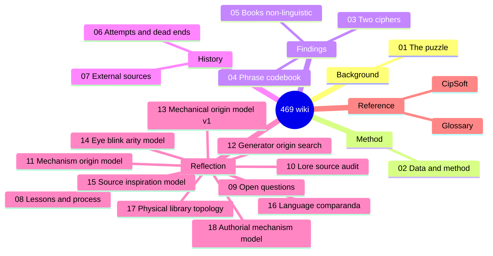

# The Bonelord "469" Cipher — Project Wiki

> A consolidated, navigable record of every approach tried, every result
> verified, and the honest final state of decoding the Tibia Bonelord numeric
> "language" known as **469**.
>
> **Status: CLOSED (2026-06-13).** Two findings are accepted; the book layer is
> verified non-linguistic; the only remaining unlock is external CipSoft ground
> truth. **This wiki is the published record.** The canonical, full-evidence
> document is the **[final report](../469_final_report.md)**; this wiki is its
> browsable, page-by-page companion.

*Not affiliated with or endorsed by CipSoft GmbH; Tibia and Bonelord are
trademarks of CipSoft GmbH.*

---

## What this is

The "469" puzzle is an in-game constructed numeric language spoken by Bonelords
in *Tibia*. The corpus is **70 "books"** (Hellgate / Isle of Kings / Kharos),
each a long string of digits, plus a handful of NPC/poll phrases. This project
tried to decode them. This wiki organizes the entire effort so it can be
understood, audited, and built upon.

## How to read it

Start at the top and follow the path, or jump to what you need:

| # | Page | What it covers |
|---|------|----------------|
| 1 | [The 469 Puzzle](01-the-469-puzzle.md) | What 469 is, the lore, the corpus, why it's hard |
| 2 | [Data & Method](02-data-and-method.md) | The databases, the 70 books, the digit→symbol mechanism, how claims were verified |
| 3 | [The Two-Cipher Finding](03-two-cipher-systems.md) | **Core result:** phrases and books use *different* systems |
| 4 | [The Phrase Codebook](04-phrase-codebook.md) | **Accepted deliverable:** the word-codes that decode the NPC phrases |
| 5 | [The Book Layer is Non-Linguistic](05-book-layer-non-linguistic.md) | **Core result:** the 70 books do not decode to natural language |
| 6 | [Attempts & Dead Ends](06-attempts-and-dead-ends.md) | Chronological log of every approach tried, and why each was retained or killed |
| 7 | [External Sources & Falsified Solutions](07-external-sources.md) | The web evidence, and the German "solution" that was correctly rejected |
| 8 | [Lessons & Process](08-lessons-and-process.md) | The activity-over-outcome critique; the Outcome Ledger reform |
| 9 | [Open Questions & The Only Unlock](09-open-questions.md) | What remains genuinely unknown, and the single thing that could move it |
| 10 | [Lore Source Audit](10-lore-source-audit.md) | 2026-06-18 addendum: Great Calculator, formula, pair/mirror, controls, and watchlist sources |
| 11 | [Mechanism & Origin Model](11-mechanism-origin-model.md) | Production model: numeric index table, pair geometry, homophone classes, and chunk assembly |
| 12 | [Generator-Origin Search](12-generator-origin-search.md) | Formula-generator search: scoring contract, targets, holdouts, front reports, and MDL leaderboard |
| 13 | [Mechanical Origin Model v1](13-mechanical-origin-model-v1.md) | Frozen public summary of the best mechanical fabrication model and plateau |
| 14 | [Eye/Blink Arity Model](14-eye-blink-arity-model.md) | Post-review eye/sprite arity hypothesis tested as mechanism-only, with K5 and 5x2 controls |
| 15 | [Source-Inspiration Model](15-source-inspiration-model.md) | Multi-language source lanes, Knightmare/D&D inspiration, H19-H24 tests, and plateau closure |
| 16 | [Language Comparanda](16-language-comparanda.md) | Tibia conlang/pseudo-language benchmark registry, H25-H30, confidence labels, and controls |
| 17 | [Physical Library Topology](17-physical-library-topology.md) | Hellgate/Isle/Kharos public topology, H-TOP tests, and fine-topology blocker |
| 18 | [Authorial Mechanism Model](18-authorial-mechanism-model.md) | First-principles/Knightmare mechanism prior, literal references, and hierarchical generator improvement |
| — | [Glossary](GLOSSARY.md) | Definitions of the coined terms (Layer A/B, row0, disqualifier, …) |
| — | [CipSoft](entities/cipsoft.md) | The external ground-truth holder — the only thing that could reopen the verdict |

## The bottom line in three sentences

1. **There are two different ciphers.** The NPC *phrases* are a variable-length digit-group **word-code** (partially crackable); the 70 *books* are a separate fixed-2-digit **symbol** system. They are not the same code. → [page 3](03-two-cipher-systems.md)
2. **The phrase codebook is real but small** (10 words; 6 codes attested in-DB + 7 reconstructed; only one code generalizes across phrases) and is validated only against the project's own decoder, not against CipSoft-attested text. → [page 4](04-phrase-codebook.md)
3. **The book layer is verified non-linguistic** — its symbol-frequency profile is closer to flat-random than to any language, its only structure is verbatim cross-book templating, and the mathemagic/number hypothesis is exhausted. No internal method can decode it; only external ground truth could. → [page 5](05-book-layer-non-linguistic.md)

**Post-final lore addendum (2026-06-18):** a systematic review of Great
Calculator, Demona formula/Magic Web, pair/mirror, Secret Library, Paradox
Tower, Spirit Grounds, and other lore fronts found no new translation or
ground truth. The exhaustive follow-up confirmed `74032 45331` as an external
untranslated Secret Library book, but it has zero exact hits in the 70-book raw
corpus. The addendum strengthens the mechanism-only framing: the lore is more
compatible with assembled/calculated/formulaic production than with hidden
plaintext. → [page 10](10-lore-source-audit.md)

**Mechanism/origin addendum (2026-06-18):** the best production model is a
handmade 10x10 numeric index table folded through mirror/unordered pairs, then
fixed homophone classes, then pre-encoded chunks copied into books. This
now has a compiled mechanical formula that roundtrips all 70 raw digit books.
The residual pass then pushes below the old 20-digit module threshold: a
permissive upper-bound explains 100% of literal residual digits, while the
MDL/control-pruned layer keeps only exact short repeats. It explains how the
book layer was likely made; it does not translate it. → [page 11](11-mechanism-origin-model.md)

**Generator-origin search addendum (2026-06-18/19):** the next pass freezes a
scoring contract, target matrix, clue ledger, Chayenne/YTC holdouts, Avar Tar
negative control, and front-by-front reports for grid formulas, Magic Web
vectors, `1 = Tibia`, homophones, zero omissions, module grammar, and seeds.
The constructive pair-table pass adds one mechanical clue: homophone inventory
size strongly tracks internal symbol frequency, while exact pair-cell placement
by source text or lore seed still fails. A symbol-vs-digit origin test then
shows repeated chunks usually preserve exact code sequences, pointing to
copied pre-rendered numeric modules rather than fresh symbol-level rendering.
The module layer now compiles into a stronger tape-based formula: 16 numeric
components, 62 module slices, 12 merged same-component spans, and 70/70 exact
book roundtrip with no plaintext claim. A later endpoint-bridge test finds that
the internal literal bridges do not transfer by adjacent tape/module endpoints
on bridge/book/residual holdouts. The current leaderboard accepts only
mechanical layers and keeps translation delta at zero. The later no-hard-gate
matrix ledger records 294,528 candidates across matrix orders, symbol orders,
lore seeds, anomaly overlays, and weak compositions; the best reaches only
21/55 pair-cell hits and classifies as lookup-disguise. Zero omission remains a
supporting render layer, not the matrix formula. A fixed shared predicate
`i>=j` now links diagonal E pressure with previous-code zero omission (`5/10`
diagonal E, `2/2` 33/66 anchors, joint `p=0.00280`), but it still does not
derive labels or the table. Lore-number phase masks over
`1`, `3478`, Honeminas/Magic Web, and `74032/45331` fail controls. A later
lore-anomaly operator pass also rejects the narrower idea that `469` or the
lore numbers select only the small anomaly sets. A later human-predicate
rule-cover pass reaches 34/55, but shuffles do at least that well, so it is
also rejected as lookup-disguise. A per-symbol predicate/DNF pass reaches
44/55, but costs `4.592x` lookup and is ordinary under shuffles, so it is also
lookup-disguise. A simple algebraic digit-composition pass hits 55/55 only by
creating 55 buckets; its best compact row is 35/55 at `1.535x` lookup. A
marginal-constraint solver finds a weak but real `6<->9` constraint signal
(`0.947x` raw lookup, p `0.00200`), yet it still leaves about `2^141` possible
tables. A hidden digit-order distance pass reaches a
flashier 48/55, but only with 40 groups and higher-than-lookup MDL, and shuffles
also reach 48/55. The latest ordered-surface audit finds a strong rendering
rule: 99/100 ordered codes exist, only `39` is absent, the lower triangle is a
near-perfect mirror of the upper, and the only true directed conflict is
`19 -> I` vs `91 -> N`; this improves the mechanical orientation layer, not
the unresolved origin of the pair-cell labels. A directed sequence-generator
follow-up finds signal only in full/mirror ordered traversals, not in the
upper-only table, so it also reinforces rendering rather than origin. Subsequent row/column balance,
graph-motif, local 2D neighbour-rule, direct coordinate-to-symbol,
line-template, row-transition edit, endpoint-affinity, composite objective,
and joint zero/homophone context probes also reject those as original
cell-placement formulas.
A digit/symbol automorphism pass adds one weak matrix-side clue: swapping
digit identities `6` and `9` preserves 47/55 pair labels and 10/18 moved cells.
A quotient follow-up sharpens that into a tiny lossless compression: 46 orbits,
50 labels, 4 mixed two-cell orbits, and `3.6` rough bits saved vs raw pair
lookup. The quotient inventory pressure is slightly sharper (`L1/slot=0.200`
versus `0.218`), but mixed-orbit overhead removes MDL promotion, and a direct
search over 1,248,362 quotient-coordinate formulas reaches only 16/46 at
`1.741x` quotient lookup. A parallel quotient line/order pass finds nominal
scan structure but still costs more than lookup (`1.550x` for the best line
template). A constructive quotient fill using inventory + order + symbol cycle
beats controls weakly but reaches only 17/46 at `1.700x` lookup. A low-rank
SVD follow-up on the quotient is control-negative (`11/46`, `p=0.56436`), so
the quotient does not rescue the continuous-surface hypothesis. A secondary rule describes the mixed orbits (`x <= 1 or x mod 5 == 3`,
orientation by parity), but controls classify it as a nine-case microfit, so
it still does not generate the labels. A tape-position threshold separates the
same four mixed orbits but also fails 4-of-9 controls. Cell-local hash/PRNG formulas,
set-block/biclique decompositions, visual 6/9 geometries, and digit-signature
formulas were also tested and rejected by MDL/controls. The exact seven-segment
rotation exception set is now identified as anchors `0` and `8`, but two-of-five
controls make it a weak microfit, not a promoted origin rule.
→ [page 12](12-generator-origin-search.md)

**Mechanical origin model v1 (2026-06-19):** the public state is now frozen as
a partial fabrication model, not a translation. Accepted mechanics are the
row0 substrate, unordered-pair/mirror geometry, directed render exceptions,
the 16-tape/62-slice 70/70 formula, MDL-surviving exact residual repeats,
Chayenne as secondary compatibility, and zero omission as a render layer.
Weak clues include `6<->9`, E-layer pressure, orientation/render, and ML's
zero signal. Rejected origin formulas include broad 10x10 matrix searches,
PRNG/seeds, lore-number masks, high-block blocker strokes, and render-origin
E-priority probes. → [page 13](13-mechanical-origin-model-v1.md)

**Eye/blink arity review (2026-06-19):** the post-review hypothesis that
Bonelord eyes could define digit arity was integrated and tested. The arity
match is elegant: `5 eyes -> C(5,2)=10` eye-pair events and therefore 55
unordered two-event cells, exactly the row0 table scale. Actual K5 and `5x2`
tests reject the hypothesis as the pair-cell label formula (`18/55` and
`20/55` best label hits, both worse than lookup after MDL cost). It remains a
mechanism-only lore bridge for arity/orientation, not a semantic decoder.
→ [page 14](14-eye-blink-arity-model.md)

**Source-inspiration model (2026-06-20):** a parallel multi-language source pass
and mechanism-inspiration audit covered official/in-game material, EN/global,
PT-BR/BR, PL, ES/LATAM, DE/other lanes, Knightmare/quest mechanisms, D&D
Beholder parallels, Bonelord Tome, `3478`, `486486`, Secret Library
`74032 45331`, Honeminas/Magic Web, Excalibug, and H19-H24. It found no
`official_gt`, no new plaintext, and no new real formula-discovery direction.
Its value is source hygiene, rejected-claim provenance, explicit blockers, and
controlled watchlist/weak-clue classifications. → [page 15](15-source-inspiration-model.md)

**Language-comparanda addendum (2026-06-20):** a separate pass incorporated
Tibia constructed/pseudo-language material as controls: Jekhr/Deepling,
Orcish, Chakoya, Gharonk, Elven, KAPLAR, spell formulae, and Caveman watchlist
material. Jekhr is the important positive control because it has an explicit
written-symbol to Latin/pronunciation/vocabulary pipeline, but no known Tibia
language is promoted as the 469 key. The result is a future benchmark and
confidence-label registry only; `translation_delta = NONE`. → [page 16](16-language-comparanda.md)

**Physical-topology addendum (2026-06-20):** a public topology pass incorporated
Hellgate overview/bookcase order, Isle shelf 21/39 anchors, and the
Kharos/Ferumbras watchlist. It built a partial Hellgate bookcase manifest and
tested public order/bookcase grouping against row0 similarity shuffles. The
result did not promote a topology mechanism (`translation_delta = NONE`);
fine-grained tile/slot/orientation/read-order evidence remains blocked.
→ [page 17](17-physical-library-topology.md)

**Authorial/mechanism addendum (2026-06-20):** a first-principles Knightmare
design report was integrated as a mechanism-search prior, not an intent claim.
It reinforces the small phrase-code plus mechanical book-layer model and adds
one mechanical improvement: a literal-reference tape formula that replaces 36
remaining literal items with existing tape-component references, saves roughly
`1167.4` bits under the local screen, survives component-shuffle and
random-literal controls, and still roundtrips 70/70 books. A follow-up
hierarchical formula reconstructs the tape inventory by self-reference and then
renders all books, reaching roughly `13858.5` bits with 16/16 component and
70/70 book roundtrip. A direct provenance-to-pair-table audit rejects the same
features as row0 origin (`16/55`, control `p=0.4194`). A later sequential LZ
book formula tightens the copy/reference upper bound to roughly `10190.0` bits
with 70/70 roundtrip; arbitrary non-numeric book orders are not promoted after
charging permutation cost. Re-costing the same generator with literal runs
instead of per-digit literal flags tightened the mechanical upper bound at that
stage to roughly `9944.0` bits. A dynamic-programming parse under the same
run-literal vocabulary tightens it further to roughly `9823.3` bits, still
with translation delta zero. Follow-up address models do not improve it, but
the committed copy graph/literal atlas now records source hubs and literal-seed
reuse. Structured public Hellgate/bookcase orders were tested under DP LZ and
do not beat numeric order. Literal-seed addressing is not promoted because
mode bits erase the apparent gain; grouped mode coding narrows but does not
reverse that result. Copy-hub macro ledgers are also worse than absolute
`source_pos`. A restricted motif-dictionary reparse roundtrips 70/70 but does
not beat the DP LZ baseline. Sweeping the DP `min_len` parameter keeps
`min_len=6` as the best tested setting under gamma length coding. Replacing
gamma copy-length coding with Rice `k=4` and reparsing at `min_len=5` improves
the current mechanical upper bound to roughly `9596.5` bits; a broader
length-code grid retains that setting. Retesting address ledgers on the Rice
parse keeps absolute `source_pos` as the best decodable source ledger.
Re-encoding literal-run lengths with Rice `k=3` improves the current bound
again to roughly `9545.5` bits, and a joint length-code grid retains that exact
parameter set. Adaptive literal-payload coding lowers the bound again to
roughly `9538.0` bits without changing the recipe; retesting address ledgers on
that formula keeps absolute `source_pos` as the best decodable source ledger.
A one-step literal-to-copy repair lowers the current bound to roughly `9537.3`
bits, a post-repair payload alpha sweep retains `alpha=14`, and a post-repair
address retest again rejects literal-seed addressing as optimistic-only. A
compatible pair-repair search also fails to improve on the one-step repair.
Replacing independent gamma-coded book lengths with a declared signed-Rice
residual ledger then lowers the mechanical bound to roughly `9073.3` bits; a
multi-anchor length ledger is tested and rejected after mode costs. Recompiling
copy addresses over the digit-only stream lowers the bound again to roughly
`9070.8` bits; alternate digit-only address ledgers are retested and rejected.
A digit-address local repair lowers the bound again to roughly `9070.1` bits.
The follow-up payload alpha sweep retains `alpha=14`.
Semantic delta remains zero. → [page 18](18-authorial-mechanism-model.md)

**Post-review closure (2026-06-19):** the remaining review action items are
compiled in [`analysis/post_review_20260619/`](../../analysis/post_review_20260619/):
observer/render audit, E-layer lore bridge, external numeric classifier,
Demona/Magic Web subledger, sprite count audit, and a completion matrix. The
official future-evidence gate is tracked in
[official_469_watchlist.md](../watchlist/official_469_watchlist.md).

## Reproduce / verify

Every quantitative claim is re-derivable from committed evidence: the audit
scripts and raw outputs are in
[`analysis/audit_20260609/`](../../analysis/audit_20260609/), and the full
reproduction guide (tables, read-only DB, script map) is the
[final report §10](../469_final_report.md). The operational DB is regenerated
from the committed workbooks via [`scripts/`](../../scripts/README.md).

## Canonical & historical documents

- **Canonical:** [docs/469_final_report.md](../469_final_report.md) — the
  definitive document; supersedes all earlier snapshots.
- **Post-final addendum:** [docs/wiki/10-lore-source-audit.md](10-lore-source-audit.md)
  and [`analysis/lore_audit_20260618/`](../../analysis/lore_audit_20260618/) —
  incorporates the 2026-06-18 lore audit as mechanism/context/watchlist
  material, confirms the Secret Library numeric book as unglossed external
  evidence, and keeps the translation delta at zero.
- **Mechanism/origin addendum:** [docs/wiki/11-mechanism-origin-model.md](11-mechanism-origin-model.md)
  and [`analysis/mechanism_model_20260618/`](../../analysis/mechanism_model_20260618/) —
  consolidates the generator/index/pair model, publishes the lossless
  mechanical formula, and keeps the translation delta at zero.
- **Generator-origin search addendum:** [docs/wiki/12-generator-origin-search.md](12-generator-origin-search.md)
  and [`analysis/generator_search_20260618/`](../../analysis/generator_search_20260618/) —
  freezes the scoring/holdout contract and runs the generator-formula
  leaderboard, including the no-hard-gate matrix ledger, without promoting
  semantics.
- **Mechanical origin model v1:** [docs/wiki/13-mechanical-origin-model-v1.md](13-mechanical-origin-model-v1.md) —
  freezes the current best fabrication model as accepted mechanics, weak
  clues, and rejected origin formulas, with translation delta still zero.
- **Eye/blink arity review:** [docs/wiki/14-eye-blink-arity-model.md](14-eye-blink-arity-model.md)
  and [`analysis/eye_model_20260619/`](../../analysis/eye_model_20260619/) —
  tests the post-review eye/sprite hypothesis as K5 and `5x2` arity models;
  keeps it as mechanism-only context and rejects it as a row0 label formula.
- **Source-inspiration model:** [docs/wiki/15-source-inspiration-model.md](15-source-inspiration-model.md)
  and [`analysis/inspiration_model_20260620/`](../../analysis/inspiration_model_20260620/) —
  consolidates multi-language source lanes, Knightmare/D&D/quest inspiration,
  H19-H24 tests, and blocked/rejected claims; keeps translation delta at zero.
- **Language comparanda:** [docs/wiki/16-language-comparanda.md](16-language-comparanda.md)
  and [`analysis/language_comparanda_20260620/`](../../analysis/language_comparanda_20260620/) —
  registers Tibia conlang/pseudo-language controls, H25-H30, confidence labels,
  and benchmark stop rules; keeps translation delta at zero.
- **Physical library topology:** [docs/wiki/17-physical-library-topology.md](17-physical-library-topology.md)
  and [`analysis/physical_topology_20260620/`](../../analysis/physical_topology_20260620/) —
  registers partial public topology, H-TOP1-H-TOP5, and shuffle-tested
  order/bookcase signals; keeps translation delta at zero.
- **Authorial mechanism model:** [docs/wiki/18-authorial-mechanism-model.md](18-authorial-mechanism-model.md)
  and [`analysis/authorial_mechanism_20260620/`](../../analysis/authorial_mechanism_20260620/) —
  incorporates the first-principles/Knightmare report as mechanism prior and
  compiles and control-tests literal-reference, hierarchical reference, and
  sequential LZ book/run-literal/dynamic-parse/Rice-length/literal-length
  formulas, plus copy-address and copy-graph/order audits; keeps translation
  delta at zero.
- **Historical (superseded, retained for provenance):**
  [docs/469_frozen_deliverable_2026-06-01.md](../469_frozen_deliverable_2026-06-01.md)
  and the per-iteration plans in [docs/plans/](../plans/README.md). Some figures
  in these predate the 2026-06-09 corrections — trust the final report where they
  differ.

## Provenance & honesty note

Every quantitative claim in this wiki was re-derived from the read-only
operational database and, where it touched the web, checked against the actual
source page. Two honesty corrections made during the work are recorded on
[page 8](08-lessons-and-process.md): the phrase "ground truth" is weaker than
first stated (it is circular against the project's own decoder), and an early
data read was corrupted by a terminal bug and discarded. The work used
adversarial verification at every step; findings that could not survive a
self-anagram / null-baseline control were rejected as pareidolia.
